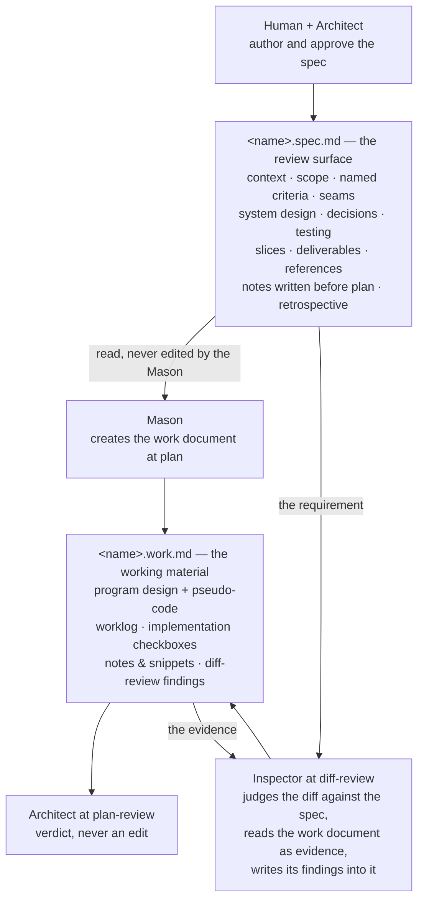

# Split the task file into a spec document and a work document

**Status:** 🟢 Complete (2026-09-02)

---

> 🧑 **REVIEW CAREFULLY** — human decision surface. Read it all before any code. Keep it short.

## Context

One file holds two audiences today. The task file carries the human's decision
surface — context, scope, acceptance criteria, seams, system design — and, in
the same document, the coding agent's working material: the program design,
the pseudo-code, the worklog, the implementation checkboxes.

The 360 review of 2026-08-27 found the consequences already lived in this
repo. They are recorded in `project-management/review-360-decisions.md`,
section "B · Contradictions de doctrine", entry "code-review réduit la spec à
4 sections", and section "C · Lisibilité des tâches", and they are not
re-argued here: a review skill that hardcodes four sections and so never
judges the diff against the system design; design sections of four hundred
lines inside the surface the human is told to read carefully; an Owner
decision written into the agent zone, called arbitrated, and unknown to the
Owner; and a Mason contract that forbids editing a zone marked 🧑 while the
formulas order the Mason to write its program design into one — a contract
broken by the pipeline that ships with it.

This task is the second chantier of the action plan at the bottom of that
file, section "Plan d'action révisé", item 2 ("Split spec / document de
travail"). Every decision below is **already made by the Owner**; this spec
specifies its application and reopens nothing. The rulings from the interview
that settled it are recorded as the entry "G14 — Le split spec / travail,
tranché en interview le 2026-08-28" in the same file, section "G · Règles de
rédaction & questions transverses" — naming, the section boundary, the
lifecycle, the migration, the two templates, and the disappearance of the
agent zone from the spec.

What changes, in one paragraph: a task becomes two files. The **spec
document** is the review surface and nothing else — what the human approves,
what the reviewer judges the diff against, and what survives in the archive as
the record of what was asked. The **work document** is the coding agent's own
file — its program design, its pseudo-code, its worklog, its implementation
checkboxes, and the findings the reviewer writes at the diff review. The Mason
creates its work document itself, when the work starts. The Mason never edits
the spec document, and that prohibition becomes exact instead of being broken.
The task files still to do are renamed; the done history keeps its names.

The Owner's précision of 2026-08-28, recorded under item 2 of that action
plan, is the direct order this task executes: « Le program design doit être
persisté dans \*\*\*-work, un document qui appartient au maçon. Le Mason ne
doit pas éditer la tâche d'origine. Il nous faut certainement 2 templates
d'ailleurs. » The hyphen in that quotation was a hypothesis, not a ruling; the
G14 entry settles the form as a dot.

## Scope

What is in and what is out. The reasons are in the Architecture section and
the Implementation Decisions; the file-level detail is in the per-slice maps
and the Deliverables. Neither is repeated here.

**Included:**

- **Two templates replacing one** — a spec template and a work template,
  written; the single task template deleted. Both are managed files of the
  CLI: `chisel init` lays them down, the manifest tracks them, and nothing in
  the socle or the installer names the old one any more.
- **The section boundary** ruled by the Owner in the entry "G14 — Le split
  spec / travail, tranché en interview le 2026-08-28" of
  `project-management/review-360-decisions.md`, section "G · Règles de
  rédaction & questions transverses". The two lists are in the Architecture
  table. One addition this spec argues for: the spec document keeps a short
  **Notes** section for what is written into it before a work document exists.
- **The naming convention** from that same entry — a dot segment, never a
  hyphen — stated in the two templates, in `AGENTS.md`, in the glue template,
  and in the slicing skill.
- **One work document per spec that actually gets typed**, created by the
  Mason at `plan`, living in its spec's directory, archived alongside it at
  `close`. A parent of a sliced task never has one.
- **The five formulas follow** — their `plan`, `type`, `diff-review` and
  `close` steps.
- **The Mason's prohibition becomes exact** — every write the socle currently
  sends into the spec file moves to the work document. The Architect validates
  that document and never edits it; the Inspector reads it as evidence and
  writes its findings into it.
- **The vocabulary stops being ambiguous** — with two files per task, "the
  spec file" names nothing precise. The socle says **the spec document** and
  **the work document** throughout. A rename, not new doctrine, and it is what
  lets one criterion bite across every carrier at once.
- **The review judges the whole spec document** — the Spec axis stops
  enumerating four sections, and the program design becomes evidence rather
  than a reference to judge against.
- **Named acceptance criteria, never erased** — ruled in the same decisions
  file, section "C · Lisibilité des tâches", entry "ACs numérotés → ACs
  nommés", and placed in this chantier by the action plan.
- **The doctrine and the satellite skills follow** — the methodology, the
  ambient discipline, the AGENTS block, and the four skills that name a Design
  section, a worklog, a task file's structure or the coordination pointer.
- **Migration of the task files still to do** — « on laisse l'historique
  `done` tel quel, mais renomme les taches à faire ». Six files, inventory in
  the Notes, citing files repointed, archive untouched.
- **Test-suite parity** — the golden fixture carries the new file set and the
  suite stays green.

**Not Included:**

- **Cleaning the orphan the update leaves behind.** On an already-equipped
  project, `chisel update` lays the two new templates down and leaves
  `project-management/000-task-file-template.md` behind. Ruling G14 already
  records it as the third orphan of its class, bound for the cleanup of item 4
  of the action plan (the Deno port). A companion residue is noted in the
  Notes: that project's glue keeps a line naming one template. Neither is
  cleaned here.
- **Any other CLI change** — `bin/chisel.sh` is touched for one thing only,
  one managed file becoming two. The rest is the Deno-port chantier.
- **The normative extraction and the writing-rule sweep** — chantier 5.
- **The claims in `PHILOSOPHY.md` and `README.md`** — chantier 3, with one
  mechanical exception: the link `PHILOSOPHY.md` carries to the task template
  is repointed here, because this task is what breaks it.
- **A status model for tasks** — item 7 of the action plan. The six status
  emoji are unchanged.
- **Auditing the vendored skills against the doctrine** — the chantier opened
  by ruling G9 of the first addendum. The review, slicing and retro skills are
  touched here for this split only, not for their upstream drift.

## Acceptance Criteria

Cite these by name. An amended criterion is never erased: strike the original,
date the new version below it. Every grep was **run against the repo and
confirmed to match** — when this spec was written, and again after the spec
review. "Returns nothing" therefore proves a real deletion. The match counts
and the carrier lists are in the Notes; a Mason that rewords a grep re-runs it
against the pre-work state before trusting it.

- [x] **two-templates-shipped** — `test -f socle/templates/000-template.spec.md
  && test -f socle/templates/000-template.work.md && test !
  -f socle/templates/000-task-file-template.md` passes.

- [x] **old-template-cited-nowhere** — `grep -rn "000-task-file-template"
  socle/ bin/ test/ AGENTS.md PHILOSOPHY.md` returns nothing. The scope stops
  there on purpose: what is under `project-management/` is history, and the
  Owner's migration ruling leaves history alone.

- [x] **both-templates-installed-and-managed** — Given a fresh `chisel init`,
  When the tree is listed, Then both templates exist under
  `project-management/`, the old one does not, and `chisel check` reports both
  as managed. Mechanically: `grep -c "000-template"
  test/fixtures/golden-tree.txt` returns 2, and `grep -n
  "000-task-file-template" test/fixtures/golden-tree.txt` returns nothing.

- [x] **spec-document-is-all-review-surface** — `grep -n "AGENT ZONE"
  socle/templates/000-template.spec.md` and `grep -n "🧑"
  socle/templates/000-template.work.md` both return nothing; Given the two
  templates, When read, Then the spec document is entirely a review surface
  ordered by the reading gradient, and the work document carries no zone
  marker because it has one owner. This reads the templates only; the profiles
  are covered by **the-roles-name-the-work-document**.

- [x] **the-spec-keeps-a-notes-section-for-pre-plan-writers** — Given
  `socle/templates/000-template.spec.md`, When read, Then it carries a Notes
  section scoped to what is written before a work document exists — the spec
  review's findings, and the assumptions a gateless preset records — and says
  it is not the Mason's working space. And Given
  `socle/agents/profiles/checker.md`, When read, Then its instruction to write
  findings into the Notes of the spec still resolves to a real section.

- [x] **named-criteria-in-the-spec-template** — `grep -n "Criterion 1"
  socle/templates/000-template.spec.md` returns nothing; Given the template's
  Acceptance Criteria guidance, When read, Then it requires a name per
  criterion, understandable in place, and states that an amended criterion is
  struck with its dated replacement below rather than rewritten by erasure.

- [x] **work-document-owns-the-program-design** — Given
  `socle/templates/000-template.work.md`, When read, Then it carries the
  program design and its pseudo-code, the worklog, the implementation
  checkboxes, Notes & Snippets and the diff-review findings, and says who
  creates it and when: the implementing session, at `plan`, in the spec's own
  directory, named by replacing the `.spec.md` suffix with `.work.md`.

- [x] **the-program-design-has-left-the-spec** — `grep -rn "Design section"
  socle/` returns nothing. One grep covering three slices; its eight carriers
  today are listed in the Notes.

- [x] **no-file-says-the-spec-file** — `grep -rn "the spec file" socle/`
  returns nothing. With two files per task the phrase names nothing precise,
  so every occurrence becomes **the spec document** or **the work document**,
  whichever it means. This is the criterion that gives the doctrine slice
  teeth on the files no narrower grep reaches — the ambient discipline, the
  AGENTS block, the Architect and Inspector profiles, the two formula headers
  — and it is why the vocabulary rename is in scope rather than a nicety.

- [x] **the-roles-name-the-work-document** — `grep -rl "work document"
  socle/agents/profiles/` lists `mason.md`, `architect.md`, `inspector.md` and
  `foreman.md`. The phrase appears nowhere in the socle today, so this bites
  from the first line written. Given those four profiles, When read, Then the
  Mason creates and owns the work document, the Architect returns a verdict on
  it and never edits it, the Inspector reads it as evidence and writes its
  findings into it, and the Foreman archives it with its spec at `close`.

- [x] **formulas-send-the-work-to-the-work-document** — `grep -rn "checkboxes
  in {{spec}}" socle/agents/formulas/` returns nothing; Given each of the five
  formulas, When its `plan`, `type`, `diff-review` and `close` steps are read,
  Then the program design is persisted into the work document, the checkboxes
  are ticked there, the `plan` step no longer has the Mason update the spec
  document's status, the diff review receives the spec document as its
  requirement and the work document as evidence, and `close` **archives both
  files**, promoting the evergreen material out of the work document first.

- [x] **spec-axis-judges-the-whole-spec** — `grep -n "Context, Scope,
  Acceptance Criteria, Seams" socle/agents/skills/code-review/SKILL.md`
  returns nothing; Given the skill's spec-source and Spec sub-agent steps,
  When read, Then the requirement is the whole spec document, system design
  included, and the work document is evidence only, never a reference to judge
  against — a divergence between the two designs being a finding to judge.

- [x] **slice-task-emits-spec-documents-only** — `grep -n "Design — persisted
  at plan time" socle/agents/skills/slice-task/SKILL.md` returns nothing;
  Given the skill's publishing step and its emitted slice template, When read,
  Then each slice is published as `<NN>-<slug>.spec.md`, the template carries
  no Design section, and it says the implementing session creates the matching
  work document at its plan step.

- [x] **beads-and-retro-name-the-right-document** — `grep -n "the persisted
  Design" socle/agents/skills/chisel-beads/SKILL.md` and `grep -n "The spec
  file's persisted Design, implementation checkboxes"
  socle/agents/skills/retro/SKILL.md` both return nothing, while `grep -n
  "spec-id" socle/agents/skills/chisel-beads/SKILL.md` still matches; Given
  the beads skill's section "1 · What owns what", When read, Then the spec
  document owns intent, acceptance criteria and seams, the work document owns
  the program design and the checkboxes, and `--spec-id` still points at the
  spec document.

- [x] **upstream-notes-tell-the-truth** — Given the three vendored skills this
  task edits — `code-review`, `slice-task`, `retro` — When the `changes` field
  of their `x-upstream` block is read, Then it records the divergence this
  task adds, so whoever syncs upstream next knows the fork moved.

- [x] **tasks-still-to-do-are-renamed** — Given every task file under
  `project-management/tasks/`, When its status line is read, Then the
  unfinished ones carry `.spec.md` and the completed ones keep their plain
  name. Both directions must print nothing — copy them whole, one line each:

  ```sh
  find project-management/tasks -name '*.md' ! -name '*.spec.md' ! -name '*.work.md' -exec grep -L '^\*\*Status:\*\* 🟢' {} +
  find project-management/tasks -name '*.spec.md' -exec grep -l '^\*\*Status:\*\* 🟢' {} +
  ```

  The archive is untouched: `git status` shows no change under
  `project-management/archive/`. Run the first BEFORE the rename — it must
  ~~list the seven unfinished files, this spec included, or it proves
  nothing~~. Amended 2026-09-02 by the thread owner under the Owner's
  standing go (the snapshot predates the slice-02/03/04 status bookkeeping,
  which moves the count as slices close): the first command's BEFORE output
  IS the rename inventory — it must list every unfinished file, this spec
  included, and the list is pasted whole into the slice-05 work record
  before any rename, or it proves nothing.

- [x] **no-task-citation-points-at-a-missing-file** — every cited path of the
  shape `project-management/tasks/….md` resolves, except two fictional ones.
  It must print those two and nothing else:

  ```sh
  grep -rho "project-management/tasks/[A-Za-z0-9._/-]*\.md" \
    project-management socle bin test AGENTS.md PHILOSOPHY.md README.md |
    sort -u | while read -r p; do [ -e "$p" ] || echo "MISSING $p"; done
  ```

  The two are different paths, not one cited twice, and one of them moves
  mid-task; both are named in their before and after forms in the Notes.
  Declared limit: the pattern needs the `project-management/tasks/` prefix, so
  the two citations that name a task file by its bare name are invisible to
  it. The rename slice works from the migration inventory in the Notes, not
  from this command.

- [x] **suite-green** — `PATH="/opt/homebrew/bin:$PATH" bash test/run.sh`
  passes with zero failures. The `PATH` prefix is mandatory here and the
  reason is in the Notes.

## Seams

The same two the closed chantier
`project-management/archive/20260827-1459-remodel-roles-and-formulas.md` used,
for the same reason: this task ships text, and text has exactly two
observable boundaries here.

- **Seam 1: the socle text surface** — the files under `socle/` are the
  shipped product. The grep-based criteria above observe the doctrine directly
  at that boundary. No internal structure is asserted beyond what the criteria
  name.
- **Seam 2: the installer suite** — `test/run.sh` installs the socle into a
  scratch tree and compares it against a committed golden fixture. It gains
  the second template in its managed-file set and in that fixture, and it
  verifies the split keeps the socle installable and renderable without
  asserting anything about wording.

## Architecture

**The two documents, their owners, and when they exist.**



**The boundary, section by section**, as ruled in the entry "G14 — Le split
spec / travail, tranché en interview le 2026-08-28" of
`project-management/review-360-decisions.md`. It is not reopened at
implementation.

| Spec document | Work document |
|---|---|
| Context · Scope · Acceptance Criteria · Seams | Program design and pseudo-code |
| Architecture / system design | Worklog |
| Implementation Decisions | Implementation checkboxes |
| Testing Strategy · Slices & Dependencies | Notes & Snippets |
| Deliverables · References | The Inspector's findings from `diff-review` |
| Notes written before `plan` · Retrospective | |

The Owner's own review is not a section of any file — « ma review à moi se
fait dans le chat ou via un autre channel ». The Retrospective is a different
artifact and stays in the spec document, because the Owner rules on its
proposals. The last spec row is this spec's one addition to the ruling, and it
exists because three producers write into the spec before a work document
exists: see the Implementation Decisions, "The spec document keeps a Notes
section".

**The naming.** `<time-id>-<intention>.spec.md` and
`<time-id>-<intention>.work.md`; for a slice, `<NN>-<slug>.spec.md` and
`<NN>-<slug>.work.md`. A dot segment marks a KIND of file, the way `.test.ts`
does; a hyphen would read as part of the name. The Owner's words, the forms
rejected and why, and the two gains he noted in posing the form — the symmetry
that stops the work document reading as an appendix, and `.spec.md` sorting
before `.work.md` so the review surface comes first in the tree — are all in
the G14 entry named above, and are not restated here.

**The lifecycle, and the archive rule.** The work document is committed. While
the work is live it is deletable and regenerable — « supprimable veut
simplement dire qu'on peut le supprimer, modifier la spec, et repartir ». That
window closes at `close`, where it is archived **alongside** its spec. This
needs an explicit rule and does not follow from sitting in the same directory:
`close` moves the spec file, singular, and only a sliced task archives by
folder — so without the rule every non-sliced task would leave its work
document behind. Three reasons it must survive the archive: the diff review
reads the program design as evidence, and destroyed evidence proves nothing;
the `retro` skill names the worklog in its own "Sources" section; and rule 8 of
`socle/agents/discipline.md` makes the repo the only memory this system has.

**Where the file map lives.** The indicative files-to-modify / files-to-avoid
map belongs to the system design, so it stays in the spec document — one line
of continuity with the ruling recorded in
`project-management/review-360-decisions.md`, section "A · Jointures
normatives", entry "Allotment exigé, produit par personne". The closed
chantier 1 left the question of relocating it to this task; the answer is that
it does not move. This task's own maps are per-slice, in "Slices &
Dependencies" below — written once, there and in the Deliverables, and nowhere
else.

---

> 🧑 **REVIEW IF RELEVANT** — program design (medium/large tasks).

## Implementation Decisions

Cross-slice decisions. **Nothing here awaits the Owner:** the four questions
this spec put to him at round 1 have all been ruled — three by the Owner in
the entry "G14 — Le split spec / travail, tranché en interview le 2026-08-28"
of `project-management/review-360-decisions.md` and by the thread owner at the
spec review, one by the precedent it cited. They are recorded below as decided,
with who decided and on what.

1. **The spec document has no agent zone; the work document has no 🧑 zone.**
   **Ruled by the Owner** — G14, point 7. The reading gradient survives inside
   the spec document as two zones: REVIEW CAREFULLY (context, scope, criteria,
   seams, system design) then REVIEW IF RELEVANT (decisions, testing, slices,
   deliverables, references, notes, retrospective). The third zone disappears,
   because the agent's working space is now a different file. The work document
   carries no marker: one file, one owner. The effect the Owner named is the
   point — « le Maçon n'édite jamais une zone 🧑 » and « le Maçon n'édite jamais
   la spec » become the same sentence.

2. **The spec document keeps a Notes section, for what is written before a
   work document exists.** Decided here, at round 1 of the spec review, and it
   is the one place this spec adds to G14 rather than applying it. Three
   producers write into the spec's Notes *earlier* than `plan`, which is when
   the Mason creates the work document: the `spec-review` step of three
   formulas ("findings written into the Notes of {{spec}}"), the headers of
   `chisel-auto`, `chisel-supervised` and `chisel-auto-light` (a doubting step,
   or the Architect at spec-writing time, records what it doubts), and
   `socle/agents/profiles/checker.md` in both its frontmatter and its Verdict
   line. Ruling the whole of Notes to the work document would leave the Checker
   and the Architect with no destination that exists yet.
   This does **not** contradict G14 point 3, which sends **Notes & Snippets** —
   the Mason's working notes — to the work document. That section keeps its
   name and its destination. The spec's section is named plainly **Notes**, it
   is scoped to pre-`plan` writers, and it says so; the two never collide.
   Chosen over the alternative — naming a different destination for review
   findings — because a review of the spec is an artifact *about* the spec and
   belongs beside it, and because it costs `socle/agents/profiles/checker.md`
   no edit at all: "the Notes of the spec" stays true.

3. **One status, in the spec document, maintained by the thread owner.**
   **Ruled by the thread owner** at the spec review. « Le Mason ne doit pas
   éditer la tâche d'origine » is categorical, so the `plan` step loses the
   clause that had the Mason update the spec's status. No second status is
   invented in the work document. The Mason's resume point is unchanged: the
   implementation checkboxes, which now live in its own file.

4. **`close` archives both files, and the rule is written down.** Decided here
   after the spec review showed the earlier claim was false. The work document
   does *not* travel with its spec merely by sharing a directory: the `close`
   step of all five formulas says "move **it** to the archive", singular, and
   only a sliced task archives by folder. Left alone, every non-sliced task
   would strand its work document in the workspace — a residue of exactly the
   class this repo is already tracking. The `close` rewrite names both files.

5. **"The spec file" is retired from the socle's vocabulary.** Decided here.
   The phrase has twenty-one occurrences across eleven files and every one of
   them is a carrier this task already opens; with two files per task it names
   nothing precise. Each becomes "the spec document" or "the work document".
   Two consequences worth stating: it is what makes
   **no-file-says-the-spec-file** able to cover the Architect and Inspector
   profiles, the ambient discipline, the AGENTS block and the two formula
   headers — files no narrower grep reaches — and it adds no file to any slice
   map, because all eleven were already in one.

6. **The work document's path is derived, never a new formula variable.** It
   is the spec's path with `.spec.md` replaced by `.work.md`, same directory.
   No `[vars.work]` is added: a required variable would have to be supplied by
   the invoker, and the file does not exist until the Mason creates it at
   `plan`. `[vars.spec]` stays the single required pointer, which also leaves
   `--spec-id` of `socle/agents/skills/chisel-beads/` untouched.

7. **The Inspector writes into a file it does not own, and that is correct.**
   **Ruled by the thread owner** at the spec review, and the reason belongs in
   the file rather than in a question: findings are reports, not decisions. The
   owner of the work document remains the one who rules on them, exactly as a
   reviewer comments on code they do not own. Nothing in the ownership model
   bends, and this stops being flagged as a hole.

8. **A rename repoints its own citers, including in `PHILOSOPHY.md`.**
   **Ruled by the thread owner** at the spec review rather than spent on a
   gate. Deleting the template while leaving a link pointing at it is a broken
   state we would create ourselves. The precedent is exact: the closed chantier
   1 removed three lines from `bin/chisel.sh` for the same reason and the Owner
   answered « Retire oui ». Nothing else in `PHILOSOPHY.md` is touched.

9. **This task's own files follow the old convention until the migration slice
   renames them.** The convention does not exist when this spec is written, so
   this file and its slice files carry plain `.md` names, and the migration
   slice picks them up with the rest of the inventory. The task dogfoods the
   migration it ships, and nothing is renamed twice.

10. **The intermediate state between slices is accepted, and no shim is written
    for it.** Until the formulas slice lands, a Mason working a slice of this
    task persists its program design wherever the socle says at that moment.
    The same choice was made and held in the closed chantier 1. The final greps
    close the gap.

11. **The `--actor` list of the beads skill is left alone.** It names four
    roles and the roster has five since the Foreman became a profile. A real
    gap, and not this task's: it predates the split and belongs to the
    vendored-skills work. Noted so the next reader does not think it was
    missed.

12. **The chantier 1 retrospective proposal about who ticks what is dissolved
    here, not decided.** It deferred the question of whether the Mason ticks
    the acceptance criteria with the words "that split may dissolve this
    proposal". It does: the implementation checkboxes are the Mason's and live
    in its work document; the acceptance criteria are in the spec document and
    are ticked against reality at `close`. No clause is added to the Mason's
    contract — the file boundary says it.

## Testing Strategy

- **The named criteria are the tests.** Greps at the socle text seam, file
  existence checks, and Given/When/Then read-throughs for what a grep cannot
  judge — the section boundary, the register of the review skill, the wording
  of the Mason's prohibition.
- **Every grep criterion was run before the work and matches today**, and the
  counts are recorded in the Notes. That is the rule this repo learned the hard
  way: the Retrospective of
  `project-management/archive/20260827-1459-remodel-roles-and-formulas.md`
  found two criteria born vacuous, because the prose they grepped for was
  wrapped across a line break and had never matched. Red before green, applied
  to greps.
- **Two of the criteria are repo-wide greps rather than four narrow ones**, on
  the spec review's argument: `Design section` and `the spec file` across
  `socle/` cover every carrier at once, including the files a per-file grep
  would have missed. The cost is that they cannot go green until every slice
  has landed, which is correct — they are the task's closing checks, not a
  slice's.
- **`test/run.sh` at the installer seam.** The golden fixture is where the new
  file set is asserted, which costs the suite no lines. The suite already runs
  an integrity check named "no pointer into thin air", which fails when the
  installed socle points a reader at a file that does not exist — it will catch
  a template pointer the templates slice forgets to repoint, with no new
  assertion written.
- **On the suite's 600-line cap:** it is enforced by the runner and the suite
  sits eight lines below it, so a slice that believes it needs new assertions
  in `test/installer.sh` reports that rather than raising the cap. This is an
  inherited constraint, not a principle to defend — the decisions file already
  killed numeric limits in section "D · Code exécutable", entry "Oracle
  tautologique du rendu" (« on n'a pas de limites à mettre, c'est une fausse
  bonne idée »), and the cap dies with the Deno port.
- **Manual check at the end of the formulas slice:** read one formula by eye as
  an ordered checklist — the header promises it is readable without tooling —
  and confirm that a session following it produces a spec document, then a work
  document beside it, never writes the second kind of content into the first,
  and archives both.
- **Deliberately absent:** any assertion on the CONTENT of the two templates
  beyond the greps named above. The templates are prose, the Checker judges
  prose, and no numeric limit is put anywhere.

## Slices & Dependencies

**Sizing check, out loud.** Does this fit a single fresh context window AND end
in one demoable, verifiable pass? **No.** The surface is two templates written
from scratch, a CLI managed-file change with its fixture, four profiles, two
doctrine documents, the AGENTS block, five formulas, five skills, the glue
template, and a rename of six task files with their citers. It is cut into five
slices. Overlap between the maps is kept low on purpose: after the first, the
second and the fifth share no file and can run at once, and so can the third
and the fourth.

- **Slices:**

  1. **templates-and-installer** (blocked by: none) — the two templates
     written, the old one deleted, the CLI laying both down, the fixture
     updated, and every citation of the template PATH repointed. It runs first
     and alone because it decides what the two documents look like.
     *Files to modify:* `socle/templates/000-template.spec.md` (new),
     `socle/templates/000-template.work.md` (new),
     `socle/templates/000-task-file-template.md` (deleted), `bin/chisel.sh`,
     `test/fixtures/golden-tree.txt`, `socle/agents/project.md.tpl`,
     `socle/agents/skills/upgrade-v2/SKILL.md` (one sentence),
     `socle/agents/methodology.md` (the template pointer in its opening
     paragraph only), `AGENTS.md`, `PHILOSOPHY.md` (one link), and this repo's
     own `project-management/000-template.spec.md` and
     `000-template.work.md` replacing `000-task-file-template.md`.
     *Files to avoid:* the profiles, the formulas, the skills other than
     `upgrade-v2`, `test/installer.sh`, everything under
     `project-management/tasks/` and `project-management/archive/`, and
     `project-management/review-360-decisions.md` — ruling G14 already records
     both the section boundary and the orphan, so nothing needs adding to it.
     *Carries:* the named-criteria rule, the never-erased rule, and the spec
     document's Notes section — all template text.

  2. **doctrine-follows** (blocked by: 1 — it names the two documents the first
     slice defines, and it reopens `socle/agents/methodology.md` on different
     lines) — the prose that teaches the two-document model:
     `socle/agents/methodology.md` (reading-gradient glossary entry, "Zone
     ownership", the persist-the-program-design passage of "The two designs",
     the Program Design row of the phase table, the two-axis review paragraph),
     `socle/agents/discipline.md` — **rule 6 included**, whose escalation
     clause still sends the blocker into the spec file and would otherwise ship
     the ambient core ordering a different destination from the Mason profile —
     `socle/templates/AGENTS-block.md`, and the four profiles `mason.md`,
     `architect.md`, `inspector.md`, `foreman.md`.
     *Files to avoid:* `bin/chisel.sh`, the templates, the formulas, the
     skills, `test/`. And `socle/agents/profiles/checker.md`, with the reason
     corrected from this spec's first draft: it **does** name the Notes of the
     spec, twice, but under the decision that keeps that section in the spec
     document both lines stay true, so it needs no edit. If that decision is
     ever reversed, this file joins the map.
     *Carries:* **no-file-says-the-spec-file**,
     **the-roles-name-the-work-document**, and the doctrine half of
     **the-program-design-has-left-the-spec**.

  3. **formulas-follow** (blocked by: 2 — the step bodies point at the profile
     contracts that slice rewrites) — the `plan`, `type`, `diff-review` and
     `close` steps of the five files in `socle/agents/formulas/`, **and their
     headers**: two of them tell a doubting step to write into the spec file,
     and a third names the Notes the next step writes. The `close` rewrite
     archives both files.
     *Files to avoid:* everything outside `socle/agents/formulas/`.
     *Shares no file with slice 4 or slice 5.*

  4. **skills-follow** (blocked by: 2 — the review skill judges "the whole spec
     document" as the doctrine slice defines it) —
     `socle/agents/skills/code-review/SKILL.md` (the Spec axis stops
     enumerating four sections; the program design becomes evidence),
     `socle/agents/skills/slice-task/SKILL.md` (publishes spec documents, drops
     the Design section from its emitted template),
     `socle/agents/skills/chisel-beads/SKILL.md` (its "What owns what" section,
     and the `.spec.md` suffix in its worked example),
     `socle/agents/skills/retro/SKILL.md` (its "Sources" section, including the
     blocker line that still names the spec file). All three vendored skills
     among them — review, slicing, retro — update the `changes` field of their
     `x-upstream` block.
     *Files to avoid:* the formulas, the profiles, the templates, `bin/`,
     `test/`.
     *Shares no file with slice 3 or slice 5.*

  5. **rename-the-tasks-to-do** (blocked by: 1 — the convention has to be
     written down before files are renamed to match it) — `git mv` on the six
     unfinished task files, the citing files repointed, and this task's own
     files renamed last.
     *Files to modify:* only `project-management/tasks/`.
     *Files to avoid:* `project-management/archive/`, every completed task
     file, `socle/`, `bin/`, `test/`.

Slice files are created at plan time by the implementing sessions, not now.

Related tasks:

- **Depends on:** none. The closed chantier
  `project-management/archive/20260827-1459-remodel-roles-and-formulas.md` is
  what left the profiles and the formulas ready to be reopened here.
- **Blocks:** chantier 5 of the action plan — « Après les chantiers 1–2, les
  concepts bougent ».
- **Related:** chantiers 3 and 4, and the vendored-skills audit; what each
  owns is in "Not Included".

---

> 🤖 **AGENT ZONE** — working space; humans skim or skip.

## Deliverables

- [x] `socle/templates/000-template.spec.md` (new) — the review surface:
  Status, Context, Scope, Acceptance Criteria (named, never erased), Seams,
  Architecture / system design with the files map, Implementation Decisions,
  Testing Strategy, Slices & Dependencies, Deliverables, References, Notes
  (pre-`plan` writers only), Retrospective. Carries the naming convention, the
  one-work-document rule, the archive-both rule, and the sentence that a spec
  with no work document beside it has never been typed. Two 🧑 zones, no agent
  zone.
- [x] `socle/templates/000-template.work.md` (new) — the working material:
  program design and pseudo-code, worklog, implementation checkboxes, Notes &
  Snippets, diff-review findings. Says who creates it, when, where and under
  what name. No zone marker anywhere in it.
- [x] `socle/templates/000-task-file-template.md` — deleted.
- [x] `bin/chisel.sh` — one source constant becomes two, one manifest line
  becomes two, one install copy becomes two.
- [x] `test/fixtures/golden-tree.txt` — both templates listed, the old one
  gone.
- [x] `socle/agents/project.md.tpl` — section "A · Task workspace" declares two
  templates; section "B1 · Where task statuses live" carries the suffixed file
  names and drops the three-zone description.
- [x] `socle/agents/skills/upgrade-v2/SKILL.md` — names two managed templates.
- [x] `AGENTS.md`, `PHILOSOPHY.md` — repointed.
- [x] `project-management/000-template.spec.md`,
  `project-management/000-template.work.md` — this repo's own copies, taken
  from the socle source and not from the stale copy they replace (see the
  Notes).
- [x] `socle/agents/methodology.md` — template pointer, reading-gradient
  glossary entry, "Zone ownership", the persist-the-program-design passage, the
  Program Design row of the phase table, the two-axis review paragraph.
- [x] `socle/agents/discipline.md` — the plan-first rule, the zone-owner rule,
  and **rule 6**, ~~whose blocker destination becomes the work document~~.
  Amended 2026-09-02 per G15 (`review-360-decisions.md`, Addendum 3): rule 6's
  blocker trace lives in the task's documents — implementation blockers in the
  active work document, pre-`plan` blockers in the spec document's Notes —
  signed with the author's role plus date and time, and whoever rules on the
  block records the ruling in the same place; no shared journal line, no
  separate escalation bead. (Amendment rule of §Acceptance Criteria, applied
  by analogy to this Deliverable line.)
- [x] `socle/templates/AGENTS-block.md` — what a session tracks, and where.
- [x] `socle/agents/profiles/mason.md` — the work document is the Mason's file;
  every write the profile prescribes lands there; the prohibition becomes
  exact.
- [x] `socle/agents/profiles/architect.md` — validates the work document at
  `plan-review`, never edits it.
- [x] `socle/agents/profiles/inspector.md` — the spec document is the
  requirement, the work document is evidence and is where the findings are
  written.
- [x] `socle/agents/profiles/foreman.md` — the passage on a Mason revising its
  own program design, and the close duties including archiving both files.
- [x] The five files of `socle/agents/formulas/` — `plan`, `type`,
  `diff-review`, `close`, and the headers that name the spec file.
- [x] `socle/agents/skills/code-review/SKILL.md`,
  `socle/agents/skills/slice-task/SKILL.md`,
  `socle/agents/skills/chisel-beads/SKILL.md`,
  `socle/agents/skills/retro/SKILL.md`. Three of the four are vendored and
  carry an `x-upstream` block whose `changes` field is updated: `code-review`,
  `slice-task`, `retro`. `chisel-beads` is our own and has none.
- [x] The six unfinished task files renamed, their citers repointed, this
  task's own files renamed.

## Notes & Snippets

**Grep criteria, verified against the repo before any work** — first on
2026-08-28, then re-run after the spec review of the same day, which confirmed
every count and corrected one. A criterion that now reads "returns nothing" is
therefore proving a deletion.

| Grep | Matches | Carriers |
|---|---|---|
| `the spec file` in `socle/` | 21 | `mason.md` ×5 · the five formulas ×9, all in headers · `discipline.md` ×2 (rule 6 among them) · `architect.md` ×2 · `inspector.md` · `retro/SKILL.md` Sources · `AGENTS-block.md` |
| `Design section` in `socle/` | 8 | the five formulas · `methodology.md` ×2 ("The two designs") · `mason.md` |
| `work document` in `socle/` | 0 | none — the positive criterion bites from the first line written |
| `000-task-file-template` in `socle/ bin/ test/ AGENTS.md PHILOSOPHY.md` | 9 | |
| `checkboxes in {{spec}}` in `socle/agents/formulas/` | 5 | |
| `Context, Scope, Acceptance Criteria, Seams` in `skills/code-review/` | 1 | |
| `Criterion 1` in `templates/000-task-file-template.md` | 1 | |
| `the persisted Design` in `skills/chisel-beads/` | 1 | |
| `The spec file's persisted Design, implementation checkboxes` in `skills/retro/` | 1 | |
| `Design — persisted at plan time` in `skills/slice-task/` | 1 | |
| `AGENT ZONE` in `templates/000-task-file-template.md` | 3 | the zone table, the zone marker, the human-review checklist — corrected from 1 at the spec review |

**Migration inventory, verified on 2026-08-28** by reading the status line of
every file under `project-management/tasks/`. Six files are not complete, and
they are exactly the six the interview named:

- `project-management/tasks/20260806-0959-chisel-v1.spec.md` (🔴)
- `project-management/tasks/20260806-0959-chisel-v1/06-pilot-migration.spec.md` (🔴)
- `project-management/tasks/20260806-0959-chisel-v1/07-release.spec.md` (🔴)
- `project-management/tasks/20260826-1512-chisel-v2.spec.md` (🔴)
- `project-management/tasks/20260826-1512-chisel-v2/06-upgrade-v2-and-log-md.spec.md` (🟠)
- `project-management/tasks/20260826-2302-chisel-dogfoods-itself.spec.md` (🟠)

Every other file under `tasks/` is complete, and
`project-management/archive/` is untouched. The two slice FOLDERS keep their
names — a folder carries no suffix.

**Who cites those six, verified on 2026-08-28.** The brief for this spec said
nine files; the real number is smaller, and the difference matters because it
makes slice 5 cheap. Three files carry a citation naming one of the six with
its `.md` extension:

- `project-management/tasks/20260826-2302-chisel-dogfoods-itself.spec.md` — three
  citations of the chisel-v2 parent, and the file is itself renamed
- `project-management/tasks/20260826-1512-chisel-v2/05-chisel-beads-convention.md`
  — one citation
- `project-management/tasks/20260826-1512-chisel-v2/07-docs-and-dedup.md` —
  three citations

Two more carry a bare-slug citation of a renamed slice, without an extension,
so nothing breaks but they should be made consistent:
`project-management/tasks/20260806-0959-chisel-v1.spec.md` (naming
`06-pilot-migration` and `07-release`) and
`project-management/tasks/20260826-1512-chisel-v2.spec.md` (naming
`06-upgrade-v2-and-log-md`). The changelog cites tasks by their time id
("task `20260826-1512-chisel-v2`"), never by filename, so it needs nothing.

**Nothing in the code parses a task filename.** Verified: `bin/chisel.sh`
hardcodes exactly one task path, the template's, in three places — a source
constant, a line of the managed-file manifest, and the install copy. The test
suite names no path under `tasks/`. `socle/scripts/task-id.sh` prints
`YYYYMMDD-HHmm[-slug]` with no extension, so the suffix is appended by
whoever names the file and the script is unchanged.

**The gate command in this repo, and why the prefix is not optional.**

```
PATH="/opt/homebrew/bin:$PATH" bash test/run.sh
```

Baseline on 2026-08-28: **9 scenarios, 94 assertions passed, 0 failed**, with
the suite at 592 lines of its own 600-line cap. Without the `PATH` prefix the
default `python3` here is a pyenv without `tomllib`, the formula parse check
prints SKIP, and the suite announces green while checking neither the gates
nor the step counts. The fact is recorded in
`project-management/review-360-decisions.md` under item 4 of the action plan
(the Deno port), which is where the dependency is scheduled to disappear.

**Two illustrative task paths that resolve to nothing, and always did.** They
are two DIFFERENT fictional paths, not one path cited twice — `sort -u`
collapses duplicates, so two printed lines mean two distinct paths:

- the worked example of `socle/agents/skills/chisel-beads/SKILL.md`, printed as
  `…/20260826-1512-x/01-thing.md` before the skills slice and
  `…/20260826-1512-x/01-thing.spec.md` after it, since that slice re-suffixes
  the example. The criterion's expected output therefore changes once,
  mid-task, and that is the intended behaviour rather than a drift.
- `…/20260826-1200-fix-payroll-export.md`, which appears only in the completed
  slice
  `project-management/tasks/20260826-1512-chisel-v2/05-chisel-beads-convention.md`
  and never changes.

They are the only two exceptions the criterion
**no-task-citation-points-at-a-missing-file** allows.

**A stale copy to beware of when writing the templates.** This repo's own
`project-management/000-task-file-template.md` has drifted from the socle
source `socle/templates/000-task-file-template.md`: it lacks the "Where each
kind of content lives" section and still points at `doc/agents/workflows.md`,
a file that no longer exists. The templates slice derives both new templates
from the **socle** copy and re-copies into `project-management/`; deriving from
the local copy would freeze the stale text into the repo's own working
template.

**A companion residue for the orphan cleanup.** Ruling G14 records the old
template as the third orphan of its class on an already-equipped project. A
second, smaller residue rides along and is recorded here rather than in the
decisions file: that project's glue keeps a "Task file template" line under its
section "A · Task workspace" naming one file, and the glue is not a managed
file, so no update rewrites it. Same cleanup, same chantier.

**Writing rules in force for every artifact this task produces** — they govern
this file too. English throughout, the Owner's quotations in French inside
quotation marks (ruled in `project-management/review-360-decisions.md`,
section "G · Règles de rédaction & questions transverses", entry "Q6 : langue
des artefacts"). No bare codes — things are named by their meaning, and a code
that must truly be cited carries its meaning with it. A reference names its
file and its section title at first mention, never a bare number. No
line-number references. Named acceptance criteria, each understandable in
place. No invented numeric limit anywhere.


---

**Checker findings — `spec-review`, 2026-08-28.** Verdict: **blocking**, five
findings. Written by the Checker, which did not author this spec; the author
edits, the Checker does not. Everything the spec asserts about the repo was
re-verified against the repo today: the ten grep counts of the table above, the
two runnable criteria, the migration inventory, the citer inventory, the
three-place claim about `bin/chisel.sh`, and the gate baseline (9 scenarios, 94
assertions, 0 failed, suite at 592 lines). All hold except where a finding says
otherwise. The greps are real and they match today — the vacuous-criterion
failure of the closed chantier is not repeated here.

**Blocking 1 — the Checker and the Architect lose the only place they are told
to write, and it happens before the work document exists.** The section
boundary rules Notes & Snippets wholly to the work document, and the work
document is created by the Mason at `plan`. Three producers write into the
Notes of the SPEC before `plan` runs. The `spec-review` step of
`socle/agents/formulas/chisel-default.formula.toml`,
`chisel-auto.formula.toml` and `chisel-supervised.formula.toml` all end on
"findings written into the Notes of {{spec}}". The header of
`chisel-auto.formula.toml` and of `chisel-supervised.formula.toml` says a
doubting step "writes what it doubts into the spec file"; the same idea sits in
the header of `chisel-auto-light.formula.toml` as "into the Notes of the spec
the next step writes" — that one is the Architect at spec-writing time, earlier
still. And `socle/agents/profiles/checker.md` carries it twice, in its
`description` frontmatter and in the Verdict line of its Mission. That file is
in this spec's files-to-avoid map under the claim "verified: neither names the
task file's internal structure" — the claim is false, `checker.md` names the
Notes. This is the finding you are reading, written into the section the spec
proposes to delete. Fix one of two ways: keep a Notes section in the spec
document for what is written before `plan` (the Checker's findings, the
Architect's recorded assumptions) and let the work document carry only the
Mason's own Notes & Snippets; or name a different destination and add
`checker.md` and the `spec` / `spec-review` steps to the file maps. The first
is cheaper and it costs the boundary nothing — the Checker's findings are a
review artifact about the spec, they belong beside it.

**Blocking 2 — the naming convention reverses a written ruling and is not among
the questions put to the Owner.** `project-management/review-360-decisions.md`,
section "B · Contradictions de doctrine", entry "code-review réduit la spec à 4
sections", writes the work document's suffix as « suffixe pressenti `-work.md` »
— a hyphen. The Owner's own précision of 2026-08-28, quoted in this spec's
Context, writes « persisté dans \*\*\*-work » — a hyphen again. This spec rules
the dot form and files `-work` under "Rejected on the way", while its Context
states "Every decision below is **already made by the Owner** … Nothing here is
reopened". The dot argument is good and the Checker does not contest it; what
is blocking is that the only two artefacts say the other thing and the change
is attributed to an interview no artefact records. This is the exact shape of
the failure recorded in the same decisions file, section "C · Lisibilité des
tâches", entry "Décisions Owner enterrées en zone 🤖" — a decision called
settled that turned out to be unknown to the Owner. Fix either way: add the
naming to the list awaiting the Owner, or have the templates slice record the
Owner's ruling in `project-management/review-360-decisions.md`, dated and in his
words, exactly as that slice already records the two orphans. The second is
better — it is one paragraph and it makes the artefact true.

**Blocking 3 — a standalone task's work document is orphaned at `close`.** The
Architecture section says the work document "sits in the same directory as its
spec, so it travels with it on archive without a rule of its own". It does not.
The `close` step of all five formulas says "move IT to the archive", singular,
and the current template's own table reads "file → archive when done" for a
standalone task and "parent + folder → archive after the last slice" only for a
sliced one. Moving one file does not move its sibling. So every non-sliced task
leaves its work document behind in the task workspace — a residue of exactly
the class this repo is already tracking under item 4 of the action plan. Either
the `close` rewrite of the formulas slice archives both files, or the claim
that no rule is needed comes out of the Architecture section. The criterion
**formulas-send-the-work-to-the-work-document** should gain the archive clause
either way; as written its `close` half only covers the promotion of evergreen
material.

**Blocking 4 — the ambient core keeps sending the blocker to the spec file.**
Rule 6 of `socle/agents/discipline.md` ("Escalate, don't improvise") says to
"block the task, write the blocker into the spec file and send the report one
rung up". This spec moves the Mason's blocker to the work document and rewrites
`socle/agents/profiles/mason.md` accordingly, but its map names only two rules
of the discipline, the plan-first rule and the zone-owner rule. Rule 6 is
ambient — every session in an equipped repo reads it — so leaving it would ship
the socle with the profile and the discipline ordering two different
destinations. Add rule 6 to the doctrine slice. `socle/agents/skills/retro/`
carries the same sentence in its Sources ("Any blocker or escalation written
into the spec file"), and the criterion **beads-and-retro-name-the-right-
document** greps a different phrase, so that line survives too.

**Blocking 5 — the doctrine slice lands six of its seven files with no
acceptance criterion, and one repo-wide grep would fix it.** That slice touches
`socle/agents/methodology.md`, `socle/agents/discipline.md`,
`socle/templates/AGENTS-block.md` and four profiles. It claims to carry
**mason-never-writes-in-the-spec-document**, which greps `mason.md` only, and
**spec-document-is-all-review-surface**, whose two greps read the two templates
and no profile at all — so on the profile side that claim is empty. The repo's
own lesson, in the Retrospective of
`project-management/archive/20260827-1459-remodel-roles-and-formulas.md`, is
that a criterion which does not bite is worth nothing; a slice with no
criterion is that defect one step earlier. **Alternative the Checker proposes,
argued rather than filed:** two repo-wide greps replace the four narrow ones
and cover more ground for less text. `grep -rn "Design section" socle/` matches
8 today — five in the formulas, two in `methodology.md` ("The two designs"),
one in `mason.md` — and would have to return nothing. `grep -rn "in the spec
file\|into the spec file" socle/` matches 9 today, and the nine are precisely
the carriers this spec is trying to move: four in `mason.md`, one in rule 6 of
`discipline.md`, one in the Sources of `retro/`, one in
`socle/templates/AGENTS-block.md` ("Track progress in the spec file itself"),
and the two formula headers named in Blocking 1. One grep would then cover the
doctrine slice, the two formula headers the formulas slice's map omits, and the
retro line the skills slice's criterion misses. Note the dependency: the second
grep can only reach nothing once Blocking 1 is settled, because two of its nine
matches are the pre-`plan` Notes writers. Tune the phrasing if a legitimate use
of "the spec file" must survive — but state the pre-work match count either
way, as this spec already does elsewhere.

**Non-blocking, in descending order of consequence.**

1. *The review surface does not shrink.* The 🧑 REVIEW CAREFULLY zone of this
   file runs 408 lines and the 🧑 REVIEW IF RELEVANT zone another 225 — 633
   lines the human is told to read, against 616 for the closed chantier this
   spec takes as its precedent. The Checker does not call it unreadable: the
   prose is clear, one idea per paragraph, and each bullet stands on its own.
   It calls it redundant. The same file list is written four times — the Scope
   bullets, the files map of the Architecture section, the five per-slice maps,
   and the Deliverables checkboxes. Cutting the Scope bullets back to what is
   in and out of scope, and letting the slice maps and the Deliverables carry
   the file-level detail, would take roughly sixty lines out of the zone the
   Owner is asked to read first. Given that the chantier exists because a
   review surface grew too large to read, this is worth one pass.
2. *The count of open questions is wrong.* The Implementation Decisions
   preamble and the Notes both say "four" decisions await the Owner; three are
   marked and three are listed. The Owner will look for a fourth.
3. *One of the three is already answered by the precedent it cites.* Repointing
   the one link in `PHILOSOPHY.md` is the mechanical consequence of a deletion
   the Owner ordered, and the closed chantier's Implementation Decisions record
   his « Retire oui » to the identical shape. Asking again spends a gate on a
   question with one answer; the Checker recommends deciding it and saying so.
   The other two — the disappearance of the agent zone, and who maintains the
   single status — are correctly the Owner's, and the first is leaning already:
   the decisions file, section "C · Lisibilité des tâches", entry "Décisions
   Owner enterrées en zone 🤖", says the two-file split settles the question
   structurally.
4. *The grep table is wrong on one row.* `AGENT ZONE` matches **3** times in
   `socle/templates/000-task-file-template.md`, not 1 — the zone table, the
   zone marker, and the human-review checklist. The criterion is unaffected;
   the recorded count is not.
5. *The two allowed exceptions of
   **no-task-citation-points-at-a-missing-file** are misdescribed.* The command
   prints `…/20260826-1512-x/01-thing.md` and
   `…/20260826-1200-fix-payroll-export.md` — verified today. The second is not
   "the copy of" the first: `sort -u` collapses identical paths, so the two
   lines are two DIFFERENT illustrative paths, the second appearing only in the
   completed slice `05-chisel-beads-convention.md`. Also, once the skills slice
   re-suffixes the worked example of `socle/agents/skills/chisel-beads/`, the
   first allowed line becomes `01-thing.spec.md` — so the criterion as worded
   goes stale in the middle of its own task. Name both exceptions in their
   post-change form.
6. *That same criterion cannot see bare-filename citations.* Its pattern
   requires the `project-management/tasks/` prefix, so the citations in
   `project-management/tasks/20260826-1512-chisel-v2/07-docs-and-dedup.md` and
   in `project-management/tasks/20260826-2302-chisel-dogfoods-itself.spec.md` that
   name a file by its bare name are invisible to it. The migration inventory in
   the Notes catches them and the rename slice will act on that inventory, so
   nothing is lost — but the criterion is a weaker net than the prose around it
   suggests, and saying so keeps the next reader honest.
7. *Two vendored skills carry an upstream provenance note.*
   `socle/agents/skills/code-review/` and `socle/agents/skills/retro/` both
   declare an `x-upstream` block whose `changes` field records how the fork
   diverges from `mattpocock/skills`. The skills slice edits both and its map
   does not mention updating that field. One line each.
8. *The suite's line cap is treated as doctrine.* The Testing Strategy tells a
   slice that needs new assertions to report rather than raise the cap. That is
   the right behaviour today — the cap is enforced and the suite sits eight
   lines below it — but the decisions file already killed it in section
   "D · Code exécutable", entry "Oracle tautologique du rendu", with « on n'a
   pas de limites à mettre, c'est une fausse bonne idée », to be removed in the
   Deno port. One clause saying the constraint is inherited and dies there will
   stop a Mason defending it as a principle.

**What the Checker verified and found sound**, so it is not re-opened: the
five-slice cut and its blocking edges (the doctrine slice and the rename slice
share no file, and so do the formulas slice and the skills slice — checked file
by file); the three-place claim about `bin/chisel.sh`, which is exactly a source
constant, one line of the manifest printer, and one install copy; the fixture
being the right seam, since `managed_relative_files` derives from that printer;
the migration inventory of six unfinished files, which the pre-rename command
prints as seven with this spec included, as the criterion says it must; the
citer inventory of three files; and the reading that nothing in the code parses
a task filename. One thing the spec does not claim and could: the installer
suite already runs an integrity check named "no pointer into thin air", which
fails when the installed socle points a reader at a file that does not exist —
it will catch a template pointer the templates slice forgets to repoint,
without a single new assertion.

**Round 1 of two.** Per the Checker's contract, the author edits and the
Checker re-reads once. Findings 1 to 5 are blocking; the non-blocking list is
advice, and the author may decline it with a reason.
**Author's response to the spec review, round 1, 2026-08-28.** Every count the
Checker reported was re-run against the repo and holds; nothing in the review
is refuted. What changed, finding by finding:

1. *The pre-`plan` writers.* Accepted, with the Checker's own preferred fix.
   The spec document keeps a **Notes** section scoped to writers earlier than
   `plan` — Implementation Decisions, point 2 — and a criterion,
   **the-spec-keeps-a-notes-section-for-pre-plan-writers**, now holds it. The
   false claim about `socle/agents/profiles/checker.md` is corrected in the
   doctrine slice's map: the file does name the Notes, twice, and under this
   fix both lines stay true, so it stays out of the map for a stated reason
   rather than a wrong one.
2. *The naming reversal.* Resolved upstream while this round ran: the Owner's
   interview rulings are now recorded as the entry "G14 — Le split spec /
   travail, tranché en interview le 2026-08-28". The Context, the Scope, the
   Architecture and the References now rest on that entry, and the hyphen in
   the Owner's quoted précision is named for what it was — a hypothesis, not a
   ruling. The templates slice no longer has to write that paragraph.
3. *The orphaned work document at `close`.* Accepted; the claim was false. The
   Architecture now states the archive rule explicitly and says why it does not
   follow from a shared directory, Implementation Decisions point 4 records it,
   and **formulas-send-the-work-to-the-work-document** gained the archive
   clause.
4. *Rule 6 of the discipline.* Accepted. Rule 6 is named in the doctrine
   slice's map and in the Deliverables, and it is covered by the repo-wide grep
   below rather than by prose alone. The retro skill's twin sentence is covered
   by the same grep, and its criterion now says so.
5. *The doctrine slice's missing criteria.* The Checker's alternative is
   adopted and widened. `Design section` over `socle/` is taken as proposed.
   The second grep is broadened from `in the spec file|into the spec file` (9
   matches) to `the spec file` (21 matches across eleven files) — it subsumes
   the narrower one and additionally reaches `architect.md` and `inspector.md`,
   which the narrow form missed. Adopting it means retiring the phrase from the
   socle's vocabulary, which is defensible on its own terms now that a task has
   two files, and it adds no file to any slice map because all eleven carriers
   were already in one. A third, positive criterion,
   **the-roles-name-the-work-document**, covers `foreman.md`, which no negative
   grep reaches. The doctrine slice now has a criterion biting on all seven of
   its files. The Checker's dependency note is right and is respected: the
   second grep can only reach zero because finding 1 is settled and the two
   formula headers are reworded rather than deleted.

The non-blocking list, in order: **(1)** the review surface was cut,
and the honest figures are these. The zone the Owner reads FIRST went from 408
lines to **357** — fifty-one out, by deleting the duplicated file lists from
the Scope and the Architecture and letting the slice maps and the Deliverables
carry them, which is where the Checker said they belonged, and by cutting the
Scope back to what is in and what is out. The second zone went the other way,
from 225 to **256**: the five findings' resolutions land there — four new
Implementation Decisions, the archive rule, the corrected slice maps — and that
growth is content the review demanded, not padding. Two 🧑 zones together: 633
to **613**. The order was roughly sixty out of the first zone; fifty-one came
out, and the shortfall is stated rather than made up by densifying prose, which
was the one method ruled out. **(2)** the count of
open questions is fixed by there being none: all four were ruled, three by the
Owner and the thread owner and one by its own precedent, and the "awaiting the
Owner" machinery is gone. **(3)** accepted — the `PHILOSOPHY.md` link is
decided, not asked. **(4)** corrected: `AGENT ZONE` matches 3, not 1.
**(5)** corrected in full, in both directions, with the mid-task change named.
**(6)** accepted — the criterion now declares its own blind spot and points at
the migration inventory as the net that actually catches those two citations.
**(7)** accepted, with one correction to the finding: **three** vendored skills
carry an `x-upstream` block this task must update — `code-review`, `slice-task`
and `retro` — not two; `chisel-beads` is our own and has none. A criterion,
**upstream-notes-tell-the-truth**, now holds it. **(8)** accepted — the
Testing Strategy says the line cap is inherited and dies with the Deno port.
The Checker's closing observation is also taken: the installer's "no pointer
into thin air" check already catches a forgotten template pointer for free, and
the Testing Strategy now says so.


## Retrospective

Written at `close`, 2026-09-02. Five slices, five review rounds each shape:
plan persisted → two-round Architect validation → typing → fresh Inspector.
What worked: the two-round plan review caught real defects before typing
every time (a re-decided 🧑 zone, an unsatisfiable verification oracle, a
missed carrier); the grep-based criteria made every slice's claim checkable
by anyone. What cost: four Owner rulings had to be made mid-task (G15–G18)
because the spec's blocker doctrine and the orchestration rules were less
settled than the split itself; and the task's own slices could not follow
the convention they were shipping — the combined documents are archived
as-is (Owner ruling, 2026-09-02, accepting the slice-05 Inspector's three
escalations in the recorded state). Lesson: a task that changes a convention
should expect to be the last thing migrated to it.

## References

- `project-management/review-360-decisions.md` — the Owner's rulings this task
  applies. The governing record is the entry "G14 — Le split spec / travail,
  tranché en interview le 2026-08-28" of section "G · Règles de rédaction &
  questions transverses": it carries the naming in the Owner's words, the forms
  rejected and why, the section boundary, the lifecycle, the migration ruling,
  the two templates, and the disappearance of the agent zone from the spec. It
  supersedes the « suffixe pressenti `-work.md` » of section
  "B · Contradictions de doctrine", entry "code-review réduit la spec à 4
  sections", which is otherwise where the split and the mechanical two-axis
  review were decided. Also: the readability rulings on bare codes, line-number
  references, buried Owner decisions and named criteria (section
  "C · Lisibilité des tâches"); the artifact language (same section G, entry
  "Q6 : langue des artefacts"); the chantier itself and the Owner's précision
  of 2026-08-28 (section "Plan d'action révisé", item 2); and the
  orphan-cleanup list this task feeds (same section, item 4).
- `project-management/archive/20260827-1459-remodel-roles-and-formulas.md` and
  its slice folder of the same name — the closed chantier 1: the nearest
  precedent for shape, register and slicing, the source of the
  verify-your-greps rule in its Retrospective, and the file that deferred the
  who-ticks-what question to this task.
- `socle/agents/methodology.md`, section "The two designs" — the doctrine that
  says why the program design is written late and by the session that types
  it, which is the reason the two documents have different lifetimes.
- `socle/templates/000-task-file-template.md` — the file this task splits, and
  the source both new templates are derived from. Not
  `project-management/000-task-file-template.md`, which has drifted from it;
  the Notes say how.
- `test/TESTS.md` — what the installer suite covers, for the fixture change.
