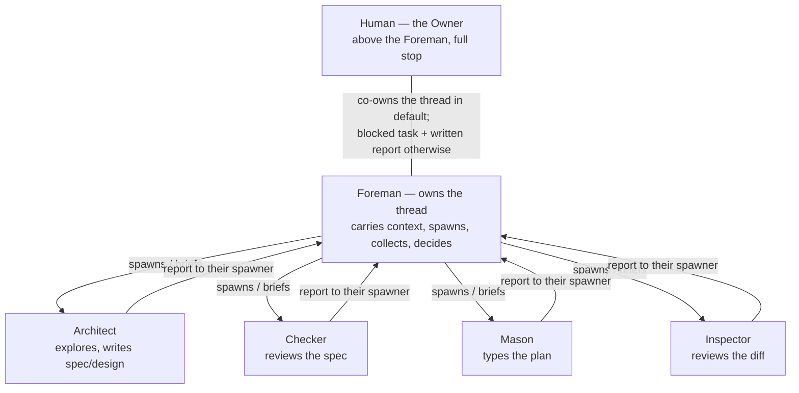

# Remodel the roles and the formulas

**Status:** 🟡 In Progress

---

> 🧑 **REVIEW CAREFULLY** — human decision surface. Read it all before any code. Keep it short.

## Context

The 360 review of 2026-08-27 produced a set of Owner rulings, recorded in
`project-management/review-360-decisions.md` (each finding of the review with
the Owner's decision on it). This task applies the doctrinal core of those
rulings — it is the first chantier of the action plan at the bottom of that
file. Every decision below is **already made by the Owner**; this spec only
specifies its application. Nothing here is reopened.

What changes, in one paragraph: the Foreman stops being "not an agent" and
becomes a real role with a profile — **the owner of one thread of work**, who
spawns the other roles and collects their reports. The Architect is unloaded
of coordination and becomes purely the high-level expert. The fixed
escalation ladder "Mason → Architect → Inspector → the Owner's digest" dies —
roles have no hierarchy; a sub-agent reports to whoever spawned it. The word
"digest" dies with the ladder (the Owner did not recognize the concept:
"gloubiboulga généré par les agents" is how he described this class of
agent-invented jargon). The hard "allotment" boundary dies, replaced by an
indicative files-to-modify / files-to-avoid map. Delegating the typing to a
Mason stops being opt-in. The three formulas are rewritten on Foreman
orchestration with slimmed step bodies, and a fourth formula, `chisel-light`,
is added: human gates kept, review sub-agents removed. One late ruling folds
in (recorded in the decisions file's Addendum while this task was being
specified): a role's spawn framing is never improvised — spawning a role
means pasting its profile body verbatim plus a per-task brief composed from
its `Inputs` section, nothing else; the delegator invents zero doctrine at
spawn time, and all five profiles — the Checker included, ruled in on
review — carry that framing in their own body.

## Scope

**Included:**

- **A Foreman profile** — new file `socle/agents/profiles/foreman.md`. The
  Foreman owns one thread / work session: carries the business context,
  spawns Architect / Checker / Mason / Inspector, composes each brief from
  the spawned role's profile `Inputs` section, collects reports, rules on
  them, and decides within what it owns. In the default preset the human
  co-owns the thread (the Foreman is the main session). This reverses the
  standing doc page `socle/agents/foreman.md` ("the Foreman is not an
  agent") — that page is **deleted** and its two pointers (the roster table
  in `socle/agents/methodology.md`, the profiles README) updated.
- **Architect unloaded of coordination** — `socle/agents/profiles/architect.md`
  keeps the thinking (exploration, interview, spec, plan, the design-check
  verdict) and loses the machinery that belongs to the thread owner: the
  "When it delegates…" brief-composition paragraph and the whole "Rule on a
  report" passage move to the Foreman profile. The Architect renders an
  artifact; it pilots no one.
- **The escalation ladder and the "digest" die** — in all 7 carrier files:
  `socle/agents/methodology.md` (section "Escalation, and the Owner's
  digest"), `socle/agents/discipline.md` (rule 6, "Escalate, don't
  improvise"), the three profiles `mason.md`, `architect.md`, `inspector.md`
  (their Escalation sections), and the header comments plus review/close
  steps of `chisel-auto.formula.toml` and `chisel-supervised.formula.toml`.
  Replacement doctrine: a sub-agent reports to its spawner (the thread
  owner); above the thread owner's authority → the task blocks and a written
  report goes one rung up, the rung above decides; above the Foreman today:
  the human, full stop. The report's **form** survives, stripped of the
  jargon: a dated ⚠️ line in the journal, plus a blocking bead when the
  coordination state is kept in beads.
- **The allotment dies** — replaced by an indicative
  **files-to-modify / files-to-avoid map** produced by the system design,
  motivated by the architecture choice, never a strict limit. The grey zone
  is assumed; the reviewer judges deviations a posteriori — a touched
  "avoid" file can be validated, or reveal a bad pattern. Touches
  `mason.md` ("never touches files outside the allotment" dies),
  `architect.md` (the per-slice allotment becomes the map), the new Foreman
  profile, and `inspector.md` (a new duty: judge map deviations, never
  forbid them).
- **Mason mandatory** — typing always goes through the Mason contract; the
  delegation is no longer opt-in. Two paths: (a) the tool can spawn → a
  Mason sub-agent is launched automatically; (b) otherwise the user is
  invited to open a fresh session and run `work on slice <file>`. The
  passages "optional Mason" and "The agent OFFERS this choice" leave
  `socle/agents/methodology.md` (section "The two designs", corollary "the
  cost gradient (opt-in delegation)", and the "Delegable?" cell of the
  dex-phases table). Companion rule, per the Owner's correction to the
  Mason ruling: **"a session opened to execute a step takes that step's role
  and reads its profile before acting"** — it lands in
  `socle/agents/discipline.md` (design decision below says why there and not
  in the AGENTS block).
- **Every profile carries its own spawn framing** — per the Addendum ruling
  G5 ("Le cadrage de spawn d'un rôle n'est jamais improvisé"): today the
  framing prompt ("You are the ARCHITECT, spawned by the Foreman…") is
  composed on the fly by the delegator — unversioned, model-dependent. From
  now on that framing lives in the role's profile: the profile body IS the
  spawn prompt, pasted verbatim, and it states in its own voice the mission,
  whom the role reports to, and what it never does. The delegator composes
  only the per-task brief from the profile's `Inputs` section (paths, scope,
  artifacts) — zero doctrine invented at spawn time. Applies to all five
  profiles: the new Foreman, the reworked architect / mason / inspector,
  and — ruled by the Owner on 2026-08-27, "incluons-le" — `checker.md`,
  the one file this ruling adds to the scope; nothing else in the Checker
  changes here. The mechanism is stated once in
  `socle/agents/profiles/README.md`: its "universal fallback / inline at
  spawn" passage becomes the RULE, not the fallback, and its "Before
  spawning a role" section gains the delegator side — brief only, never
  doctrine.
- **The three formulas rewritten on Foreman orchestration** — in
  `socle/agents/formulas/`: the invoking session IS the Foreman; each step is
  a fresh sub-agent spawned with the step role's profile; "Then STOP"
  survives only where the human relaunches (default, and the new light
  formula); in auto/supervised it becomes "the Foreman spawns the next step,
  fresh". At the `close` step the Foreman commits and pushes, named
  explicitly. Step bodies are **slimmed**: "Role: X, contract:
  `profiles/x.md`" plus only what is step-specific (order, artifacts, gates)
  — no paraphrases of profiles. Per the Owner's ruling on formula
  duplication: no generation from a common source and no identity
  assertions or tests — the drift risk is accepted ("revient à des checks
  sur des magic strings comme les greps, pas fou").
- **A new formula `chisel-light`** — the human gates remain, and the Owner
  placed them (2026-08-27): the human reviews the **spec** and the **diff**
  — "Chisel-light devrait avoir une gate au design, mais pas au plan du
  maçon. Et une autre au moment de la review en place de l'inspector."
  Removed are the review sub-agents ("la review des specs par l'humain reste
  nécessaire, ce sont les sous-agents auto (review spec, inspector) qu'on
  enlèverait"): no Checker on the spec, no design-check, no human gate on
  the Mason's plan — and at the review step the **human holds the diff
  review in place of the Inspector**. Human reading is the net. Chosen
  explicitly by the human at the sizing check ("light or full?"). The
  preset table in `methodology.md` and the AGENTS block
  (`socle/templates/AGENTS-block.md`) gain it.
- **Discipline adjustments** — rule 6 rewritten (escalation, above), the new
  incoming-session rule added, rule 9 ("read a role's profile before
  spawning it") kept and now anchored in the Foreman's duties, and rule 10
  ("a refused `update` is a redirect") loses its preset wiring: "runs it
  under `chisel-supervised` or `chisel-auto`" disappears — the upgrade
  process leaves the preset system entirely, per the Owner's ruling on
  chisel-auto (point 3).
- **Test-suite parity** — `test/fixtures/golden-tree.txt` and the render
  checks in `test/installer.sh` updated so `test/run.sh` stays green with
  the new file set (Foreman profile added, doc page removed, light formula
  added).

**Not Included:**

- **The spec / work-file split** — chantier 2 of the action plan; it will
  touch the formulas' `plan` step, the profiles, and the template again;
  sequencing between the two chantiers is decided there, not here.
- **The normative extraction from `methodology.md` and the discipline-rule
  cleanup** — chantier 5; it will touch `discipline.md` and `methodology.md`
  again (including the complete deletion of discipline rule 10, ruled in the
  minors list — this task only de-wires its presets).
- **Template changes** (`project-management/000-task-file-template.md` and
  the socle task templates) — chantier 2.
- **CLI changes** (`bin/chisel`, the test suite beyond fixture parity) —
  chantier 4, the Deno port. Stale `foreman.md` copies in already-equipped
  projects are an orphan-cleanup problem solved there.
- **The remodel of `socle/agents/profiles/checker.md`** — it carries no
  ladder, no digest, no allotment (verified by grep), and its readability
  duty arrives with chantier 5. One exception, ruled by the Owner on
  2026-08-27 ("incluons-le"): its body IS reworked here as its verbatim
  spawn prompt, per the spawn-framing bullet above — that pass only,
  nothing else in it changes.
- **`socle/agents/project.md.tpl`** — `chisel-light` keeps its human gates,
  so it is not an autonomous run and needs no enabling under "§B3 ·
  Autonomous runs" of the glue; the glue template stays untouched.
- The factory claim, PHILOSOPHY, README — chantier 3.

## Acceptance Criteria

Cite these by name. An amended criterion is never erased: strike the
original, date the new version below it.

- [ ] **foreman-is-a-profile** — `test -f socle/agents/profiles/foreman.md
  && test ! -f socle/agents/foreman.md` passes, and the new profile carries
  `name`, `description` and `tier` frontmatter like the other profiles.
- [ ] **no-digest-left** — `grep -rin "digest" socle/` returns nothing.
- [ ] **no-fixed-ladder** — `grep -rn "Mason → Architect" socle/` and
  `grep -rn "Architect → Inspector" socle/` both return nothing.
- [ ] **no-allotment-left** — `grep -rin "allotment" socle/` returns nothing.
- [ ] **map-replaces-the-boundary** — Given `architect.md`, `mason.md`, the
  Foreman profile and `inspector.md`, When read, Then the system design's
  files-to-modify / files-to-avoid map is described as indicative and
  motivated, never a strict limit, and the Inspector judges deviations a
  posteriori instead of forbidding them.
- [ ] ~~**profiles-carry-the-framing** — Given any role profile of this task
  (Foreman included), When its body is pasted verbatim as a spawned
  session's instructions, Then the session knows its mission, whom it
  reports to, and what it never does, with no doctrine added by the
  delegator; and Given `socle/agents/profiles/README.md`, When read, Then
  paste-the-body-verbatim is stated as the rule of spawning (no longer a
  fallback) and the delegator's contribution is the per-task brief from the
  `Inputs` section, nothing else.~~
  *Superseded 2026-08-27 by the Owner's ruling that the Checker joins the
  framing pass.*
- [ ] **profiles-carry-the-framing** (amended 2026-08-27) — Given each of
  the five role profiles — `foreman.md`, `architect.md`, `checker.md`,
  `mason.md`, `inspector.md` — When its body is pasted verbatim as a
  spawned session's instructions, Then the session knows its mission, whom
  it reports to, and what it never does, with no doctrine added by the
  delegator; and Given `socle/agents/profiles/README.md`, When read, Then
  paste-the-body-verbatim is stated as the rule of spawning (no longer a
  fallback) and the delegator's contribution is the per-task brief from the
  `Inputs` section, nothing else.
- [ ] **mason-not-optional** — `grep -n "optional Mason" socle/agents/methodology.md`
  and `grep -n "OFFERS this choice" socle/agents/methodology.md` return
  nothing; Given the methodology's delegation passage, When read, Then it
  states the two mandatory paths (spawn a Mason sub-agent when the tool can;
  otherwise invite a fresh `work on slice <file>` session).
- [ ] **incoming-session-rule** — Given `socle/agents/discipline.md`, When
  read, Then a numbered rule states that a session opened to execute a step
  takes that step's role and reads its profile before acting.
- [ ] ~~**light-formula-exists** — `test -f
  socle/agents/formulas/chisel-light.formula.toml` passes; the file contains
  no `spec-review`, `design-check` or `review` step, and exactly two
  `[steps.gate] type = "human"` gates (spec approved, plan approved).~~
  *Superseded 2026-08-27 by the Owner's ruling on the light gates.*
- [ ] **light-formula-exists** (amended 2026-08-27) — `test -f
  socle/agents/formulas/chisel-light.formula.toml` passes; the file contains
  no `spec-review` and no `design-check` step; a `review` step exists and
  names the **human** as the reviewer of the diff (no Inspector sub-agent);
  and there are exactly two `[steps.gate] type = "human"` gates — spec
  approved (before `plan`), and the review itself. No human gate sits on the
  Mason's plan.
- [ ] **stop-only-where-humans-relaunch** — `grep -l "Then STOP"
  socle/agents/formulas/*.toml` lists only `chisel-default.formula.toml` and
  `chisel-light.formula.toml`; Given the auto and supervised formulas, When
  a step ends, Then the Foreman spawns the next step fresh instead of
  stopping.
- [ ] **foreman-closes** — Given each formula's `close` step, When read,
  Then the Foreman is named explicitly as the one who commits and pushes.
- [ ] ~~**slim-step-bodies** — Given any step body of the four formulas, When
  read, Then it contains the role name, a pointer to that role's profile as
  the contract, and only step-specific instruction (order, artifacts,
  gates) — no restatement of the profile's prohibitions, inputs or
  escalation rules.~~
  *Superseded 2026-08-27: the original demanded a profile pointer of every
  step, but the mechanical `verify` step has no role, and the light
  formula's review step is held by the human, who has no profile.*
- [ ] **slim-step-bodies** (amended 2026-08-27) — Given any step body of
  the four formulas that a spawned role executes, When read, Then it
  contains the role name, a pointer to that role's profile as the contract,
  and only step-specific instruction (order, artifacts, gates) — no
  restatement of the profile's prohibitions, inputs or escalation rules;
  and Given a step no spawned role executes (the mechanical `verify`, the
  light formula's human-held review), When read, Then it names its actor
  and carries only step-specific instruction.
- [ ] **light-in-the-tables** — `grep -n "chisel-light"
  socle/agents/methodology.md socle/templates/AGENTS-block.md` finds a match
  in both files.
- [ ] **escalation-form-survives** — Given the rewritten escalation passage
  of `methodology.md`, When read, Then the blocked-task report form is
  defined once: a dated ⚠️ line in the journal, plus a blocking bead when
  the coordination state is kept in beads.
- [ ] **rule-10-unwired** — `grep -n "chisel-supervised\|chisel-auto"
  socle/agents/discipline.md` returns nothing.
- [ ] **suite-green** — `test/run.sh` passes with the updated golden tree
  and render checks.

## Seams

- **Seam 1: the socle text surface** — the socle files under `socle/` are
  the shipped product; the grep-based criteria above observe the doctrine
  directly at that boundary. No internal structure is asserted beyond what
  the criteria name.
- **Seam 2: the installer test suite** — `test/run.sh` installs the socle
  into a scratch tree and checks the rendered profile definitions against
  the golden tree fixture; it verifies the remodel keeps the socle
  installable and renderable without asserting anything about wording.

## Architecture

**The new role topology.** One thread of work, one owner; roles have no
hierarchy between them — authority follows who spawned whom:

A spawn consists of exactly two parts: the spawned role's profile body,
pasted verbatim (it carries its own framing — mission, whom it reports to,
what it never does), plus the per-task brief the Foreman composes from that
profile's `Inputs` section — paths, scope, artifacts, and nothing doctrinal.
In the default preset the Foreman is the main session, co-owned with the
human. The recognized two-conversation variant of default: human+Architect
for the plan, then human+Mason for the work — the Inspector then reports to
the human+Mason thread. Escalation is contextual, not a ladder: whoever
cannot decide blocks the task and writes the report (dated ⚠️ journal line;
blocking bead in beads mode); the rung above — ultimately the human —
decides.

**The four formulas.** Same nine-step pipeline; what varies is who relaunches
and which review sub-agents run:

| Formula | Gates | Review sub-agents | Step handoff |
|---|---|---|---|
| `chisel-default` | every gate awaits the human | Checker, design-check, Inspector | "Then STOP", the human relaunches |
| `chisel-light` | two human gates — spec approved, and the diff review held by the human | none — at the review step the human reviews the diff in place of the Inspector | "Then STOP", the human relaunches |
| `chisel-supervised` | one human gate (spec) | Checker, design-check, Inspector | the Foreman spawns the next step, fresh |
| `chisel-auto` | none | Checker, design-check, Inspector | the Foreman spawns the next step, fresh |

**Indicative files map for this task** (this task dogfoods the pattern that
replaces the allotment — indicative, motivated, never a strict limit):

*Files to modify:* the six files in `socle/agents/profiles/` (one created:
`foreman.md`; `checker.md` for its spawn framing only, per the Owner's
"incluons-le"), `socle/agents/foreman.md` (deleted), `socle/agents/discipline.md`,
`socle/agents/methodology.md`, the four files in `socle/agents/formulas/`
(one created: `chisel-light.formula.toml`), `socle/templates/AGENTS-block.md`,
`test/fixtures/golden-tree.txt`, `test/installer.sh` (render parity only).

*Files to avoid, and why:* `socle/agents/project.md.tpl` (light needs no
autonomous-runs enabling), `bin/chisel` (the CLI is the Deno-port chantier),
`project-management/000-task-file-template.md` (the split chantier),
`socle/agents/skills/**` (verified: no skill carries the ladder, the digest
or the allotment), `PHILOSOPHY.md` and `README.md` (the joins-and-minors
chantier).

---

> 🧑 **REVIEW IF RELEVANT** — program design (medium/large tasks).

## Implementation Decisions

Cross-slice decisions made where the rulings left room. Each was proposed,
not self-granted; the Owner reviewed this spec on 2026-08-27 and ruled on
the flagged ones — his rulings are recorded in place below, dated, and his
words stay in French.

1. **The incoming-session rule lands in the discipline**, as a new rule
   adjacent to rule 9 ("Read a role's profile before spawning it" — the
   spawner side; the new rule is the spawned side). Rationale: the
   discipline is the ambient core loaded by every conversation, including a
   fresh session a human opens by hand with `work on slice <file>` — exactly
   the session the rule must reach. The AGENTS block only routes ("This
   block only routes; the socle carries the content" — its own closing
   line) and is rewritten wholesale on update; putting doctrine there would
   contradict its charter.
2. **The Foreman doc page is deleted, not converted.** The profile replaces
   it wholesale; keeping a stub would preserve the very pointer confusion
   the ruling kills. Its two inbound pointers are rewired: the roster row in
   `methodology.md` (Foreman gains a tier and points to
   `.agents/profiles/foreman.md`) and the paragraph in
   `socle/agents/profiles/README.md` that says the Foreman is deliberately
   absent.
3. **Foreman tier: frontier.** It rules on reports, arbitrates within what
   it owns, and composes briefs — judgement work by the socle's own tier
   definition. In default the Foreman is the main session anyway, so the
   tier binds only where a Foreman is itself run headless.
   **Ruled by the Owner, 2026-08-27: accepted as proposed.**
4. **The Foreman profile carries frontmatter** (`name`, `description`,
   `tier`) so it renders per-tool definitions like every other profile —
   uniformity, and a tool that runs a whole formula in a spawned session
   needs a definition to spawn it with. The body says plainly that the
   normal case is the invoking session itself taking the role.
5. **The files map lives in the system design** — the Architecture section
   of the spec today. The Owner's ruling: the system design, made upstream,
   declares "voici les fichiers à modifier" and "voici les fichiers à
   éviter". The spec/work split (chantier 2) may relocate it; one line
   there, not here.
6. **`chisel-light` gates and shape.** ~~As proposed: two human gates —
   "spec approved" before the `plan` step (as in default) and "plan
   approved" before the `type` step (with design-check removed, the gate
   moves onto `type`); no gate at `close`.~~
   **Ruled by the Owner, 2026-08-27, superseding the proposal:**
   "Chisel-light devrait avoir une gate au design, mais pas au plan du
   maçon. Et une autre au moment de la review en place de l'inspector."
   So: gate one on the spec / system design, before the `plan` step, as in
   default; **no human gate on the Mason's plan** — nothing sits between
   `plan` and `type`; gate two **at the review moment** — light keeps a
   `review` step, and its actor is the **human**, reviewing the diff in
   place of the Inspector; no Inspector sub-agent runs. Consequence for the
   zone-ownership doctrine, corrected by the Owner on 2026-08-27 ("le plan
   appartient au maçon, c'est le maçon qui fait le programming design non ?"):
   in light the spec is the human's, the plan is the **Mason's** — the Mason
   authors the program design at the plan step, per the two-designs doctrine,
   and with no design-check in light nobody validates it — and the diff
   review is the human's.
   Unchanged from the proposal: light is **not** an autonomous run — the
   glue's "Autonomous runs" switch does not govern it — and the "light or
   full?" question is asked at the sizing check, so the `spec` step of the
   other three formulas gains that one question and the sizing passage of
   `methodology.md` (section "Why slicing is conditional") mentions it.
7. **"Then STOP" also survives in `chisel-light`.** The ruling on the
   formulas contrasts default (the human relaunches) with auto/supervised
   (the Foreman relaunches); light postdates that sentence but sits on the
   default side of the contrast — human-gated, human-relaunched. Flagged
   here because it extends the ruling's letter by its logic.
   **Ruled by the Owner, 2026-08-27: confirmed — "Oui coupure".**
8. **Discipline rule 10 is only de-wired here**, not deleted: this chantier
   applies the upgrade ruling ("runs it under supervised/auto" dies); the
   minors ruling that deletes the rule outright belongs to the
   joins-and-minors chantier. If that chantier lands first, the criterion
   **rule-10-unwired** is trivially satisfied.
   **Ruled by the Owner, 2026-08-27: accepted as proposed.**
9. **Intermediate inconsistency between slices is accepted.** Slice 1
   removes the ladder from the profiles while `methodology.md` still names
   it until slice 3; the slices are sequential in one task and the final
   greps close the gap. No shim text is written for the interim states.
10. **The Foreman's report to its Owner has a fixed shape, and it is sober.**
    Ruled by the Owner on 2026-08-27, watching this very task run: the state
    reports he was getting were too long for a flow he will use daily —
    "L'utilisateur va utiliser ce flow régulièrement, donc quand on peut
    faisons sobre", with the concision asked for "notamment en attente". Two
    shapes, both carried by the Foreman profile so tomorrow's Foreman reports
    the same way instead of improvising it: a **waiting report** is the step
    name and whom it waits on, nothing more; a **step-delivery report** is
    the step, what the role produced in substance, the decisions taken, the
    questions awaiting the Owner, and the Owner's actions — the last two as
    short numbered lists, each action carrying the link it acts on. The
    Foreman's own verification of a report is not narrated unless it changed
    a conclusion. Two rules were added the same day, after the first shapes
    were still unreadable in use: the Foreman **works silently** — no
    narration between its tool calls, no interim status line, one report at
    the end of the turn and nothing else ("il faut que le foreman reste
    silencieux jusqu'à sa conclusion et qu'il la présente") — and every
    report is **self-contained**, restating each open question in place
    rather than pointing back at an earlier message the Owner would have to
    scroll up to find ("je dois remonter sur la question 1 qui est plus haut,
    parfois beaucoup plus haut"). This is the reading-gradient doctrine the
    socle already applies to spec zones, applied to the Foreman's own output.
    This adds one section to the Foreman profile of the deliverables below;
    nothing else in the scope moves.
11. **The CLI's three references to the deleted doc page are removed here**,
    although `bin/chisel` sits in this task's files-to-avoid map. Found at
    design-check and proved in a throwaway copy: the CLI names the page in a
    source-path constant, a line of the managed-file manifest and an install
    copy, and under `set -euo pipefail` that copy aborts `chisel init` the
    moment the page is gone — the whole suite turns red, and the criteria
    named **foreman-is-a-profile** and **suite-green** cannot both hold.
    Ruled by the Owner on 2026-08-27, at the escalation the map's own
    doctrine predicts: "Retire oui". Removing three lines that name a deleted
    file is the mechanical consequence of the deletion, not the CLI evolution
    the Deno-port chantier owns; nothing else in `bin/` is touched. Recorded
    as the first lived proof of the doctrine this task ships — the map is
    indicative, a deviation is reported and judged, never forbidden in
    advance.

## Testing Strategy

- The named criteria are the tests: greps at the socle text seam, file
  existence checks, and Given/When/Then read-throughs for what a grep
  cannot judge (slimmed step bodies, map wording).
- `test/run.sh` at the installer seam: golden tree updated for the new file
  set; the render loop in `test/installer.sh` extended to cover the Foreman
  profile the same way it covers architect/mason/inspector.
- **Deliberately absent:** any identity or similarity assertion between the
  four formulas — rejected by the Owner's ruling on formula duplication
  (magic-string checks); the accepted control is the slimming itself.
- Manual check: execute each formula by eye as an ordered checklist (the
  header comments promise it is readable without tooling) — every `needs`
  edge resolvable, every role name matching a profile file.

## Slices & Dependencies

**Sizing check, out loud:** this does NOT fit a single fresh context window
ending in one demoable pass. Surface: four profile rewrites plus the
Checker's spawn-framing pass plus one new profile, one page deletion with
pointer rewiring, three formulas rewritten
plus one written from scratch, two doctrine documents and the AGENTS block,
and test-fixture parity. Cut into three slices:

- **Slices:**
  1. **roles-remodel** — the Foreman profile written; architect / mason /
     inspector rewritten (coordination moved to the Foreman, ladder and
     digest out of their Escalation sections, allotment → map); checker
     given its spawn-framing pass (that pass only); the Foreman doc page
     deleted; profiles README updated; golden tree and render checks kept
     green. (blocked by: none)
  2. **formulas-rewrite** — the three formulas rewritten on Foreman
     orchestration with slimmed step bodies; `chisel-light` written; the
     sizing question "light or full?" added to the `spec` steps. (blocked
     by: 1 — the steps point at the new profile contracts)
  3. **doctrine-alignment** — `discipline.md` (rule 6 rewrite, the
     incoming-session rule, rule 10 de-wired), `methodology.md` (roster
     row, escalation section rewritten without the digest, cost-gradient
     corollary made mandatory-Mason, preset table and zone-ownership gain
     light, dex-phases "Delegable?" cell), `AGENTS-block.md` (roster line,
     formula list gains light). Final full-socle greps pass here. (blocked
     by: 2 — it names `chisel-light`)

Slice files are created at plan time by the implementing sessions, not now.

Related tasks:

- **Depends on:** none (first chantier of the action plan).
- **Blocks:** chantier 5 (normative extraction — "Après les chantiers 1–2
  (les concepts bougent)").
- **Related:** chantier 2 (spec/work split — re-touches formulas, profiles,
  template; sequencing decided there), chantier 3 (joins & minors — deletes
  discipline rule 10 outright), chantier 4 (Deno port — orphan cleanup for
  the deleted doc page in equipped projects).

---

> 🤖 **AGENT ZONE** — working space; humans skim or skip.

## Deliverables

- [ ] `socle/agents/profiles/foreman.md` (new) — frontmatter + Mission /
  Tier / Prohibitions / Escalation / Inputs, in the house profile shape.
  Content to carry: owns one thread; carries the business context; spawns
  roles and composes briefs from the spawned profile's `Inputs` section
  (the duty moves here from architect.md); collects reports and rules on
  them (the "Rule on a report" passage moves here from architect.md,
  reworded for the thread owner); decides within what it owns; above its
  authority → task blocked + written report, the human decides; in default
  the human co-owns the thread; the two-conversation default variant named.
  Body written as the verbatim spawn prompt: it opens on the role's own
  framing — mission, whom it reports to, what it never does. Plus the
  reporting shape ruled by the Owner on 2026-08-27 (Implementation Decisions,
  point 10): the sober waiting report, and the step-delivery skeleton.
- [ ] `socle/agents/profiles/architect.md` — coordination out (delegation
  paragraph, "Rule on a report"), allotment → files map, Escalation section
  rewritten (report to spawner; blocked + written report above authority),
  frontmatter description updated; body reworked as the verbatim spawn
  prompt (its own framing: mission, reports to its spawner, pilots no one).
- [ ] `socle/agents/profiles/mason.md` — mandatory-contract framing
  untouched (the profile already assumes it); "never touches files outside
  the allotment" and the claim/allotment sentence → the map, indicative;
  Escalation ladder line → report to spawner; proposal-door "rung above"
  wording → "your spawner (the thread owner)"; body reworked as the verbatim
  spawn prompt (its own framing: mission, reports to its spawner, never
  plans or reviews itself).
- [ ] `socle/agents/profiles/inspector.md` — Escalation "Owner's digest"
  branch → blocked task + written report to the thread owner / the human;
  new duty: judge deviations from the files map a posteriori; body reworked
  as the verbatim spawn prompt (its own framing: mission, reports to its
  spawner, never the author of what it reviews).
- [ ] `socle/agents/profiles/checker.md` — body reworked as the verbatim
  spawn prompt (its own framing: mission, whom it reports to, what it never
  does), per the Owner's "incluons-le" of 2026-08-27; nothing else in it
  changes.
- [ ] `socle/agents/profiles/README.md` — "The Foreman is deliberately not
  here" paragraph replaced; the fresh-session fallback framed as the
  mandatory second path for typing; the spawn mechanism stated once — the
  "inline at spawn" passage becomes the rule (profile body verbatim), and
  "Before spawning a role" gains the delegator side: brief from `Inputs`
  only, never doctrine.
- [ ] `socle/agents/foreman.md` — deleted.
- [ ] `socle/agents/formulas/chisel-default.formula.toml`,
  `chisel-auto.formula.toml`, `chisel-supervised.formula.toml` — rewritten
  per the Architecture table; `chisel-light.formula.toml` — new.
- [ ] `socle/agents/discipline.md` — rules 6, (new incoming-session), 9
  anchored to the Foreman, 10 de-wired.
- [ ] `socle/agents/methodology.md` — sections "The roster", "Zone
  ownership", "Escalation, and the Owner's digest" (retitled), "The
  pipeline is nine steps" (light noted), "A default, and two options"
  (presets gain light; the "three presets" arithmetic corrected), "The two
  designs" corollary, the dex-phases table, "Why slicing is conditional"
  (the "light or full?" question).
- [ ] `socle/templates/AGENTS-block.md` — role list gains Foreman, formula
  list gains `chisel-light`, gate/relaunch sentence updated.
- [ ] `test/fixtures/golden-tree.txt`, `test/installer.sh` — parity.

## Notes & Snippets

- Carrier inventory for the ladder/digest, verified by grep on 2026-08-27:
  `methodology.md`, `discipline.md`, `profiles/mason.md`,
  `profiles/architect.md`, `profiles/inspector.md`,
  `chisel-auto.formula.toml`, `chisel-supervised.formula.toml` — seven
  files, matching the ruling's count. `chisel-default.formula.toml` carries
  neither word. No skill under `socle/agents/skills/` carries the ladder,
  the digest, or the allotment.
- The criterion named **no-digest-left** greps case-insensitively across
  all of `socle/` — verified on 2026-08-27 that every occurrence of the
  word, in any case, in any file (skills included), is the dying "Owner's
  digest" concept; no legitimate other sense of "digest" exists in the
  socle, so the grep needs no narrower scope.
- "Allotment" carriers: `foreman.md` (dies with the page), `architect.md`,
  `mason.md`. The Inspector never carried the word — its new duty is an
  addition, not a substitution.
- The formulas' header comments also restate doctrine (the ladder in
  auto/supervised headers, "the human gates removed" framing); the rewrite
  covers headers, not only step bodies.
- Writing rules in force for every artifact this task produces (they govern
  this spec too): English throughout, Owner quotes in French in quotation
  marks; no naked codes — name things by their meaning; no line-number
  references — file + section title; every pointer says in one clause what
  the reader finds there; no invented numeric limits ("on n'a pas de
  limites à mettre, c'est une fausse bonne idée").

## References

- `project-management/review-360-decisions.md` — the Owner's rulings this
  task applies: the Mason-mandatory ruling (B2), the roles-have-no-hierarchy
  remodel (B3), the formulas-on-Foreman rewrite (B4), the allotment ruling
  (A2), the slimmed-steps ruling (E3), the light-workflow ruling (E4 point
  2), the spawn-framing ruling (G5, in the Addendum — a role's spawn framing
  is never improvised: the profile body is the prompt, pasted verbatim; the
  delegator composes only the brief), and the writing rules (C1–C4, G1–G3).
- `project-management/000-task-file-template.md` — the template this file
  follows; chantier 2 will split it.
- `socle/agents/methodology.md` — the current doctrine being amended; its
  "Escalation, and the Owner's digest" section is the single definition
  point the remodel replaces.
- `test/TESTS.md` — what the installer suite covers, for the parity slice.
