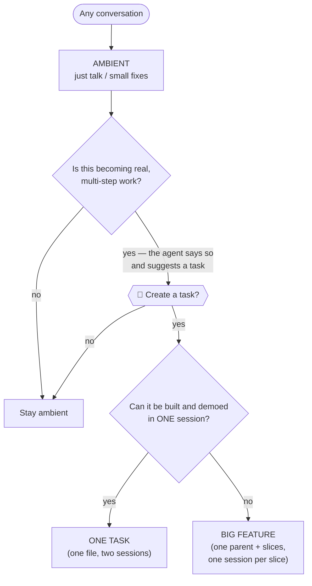
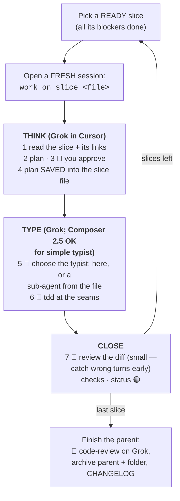
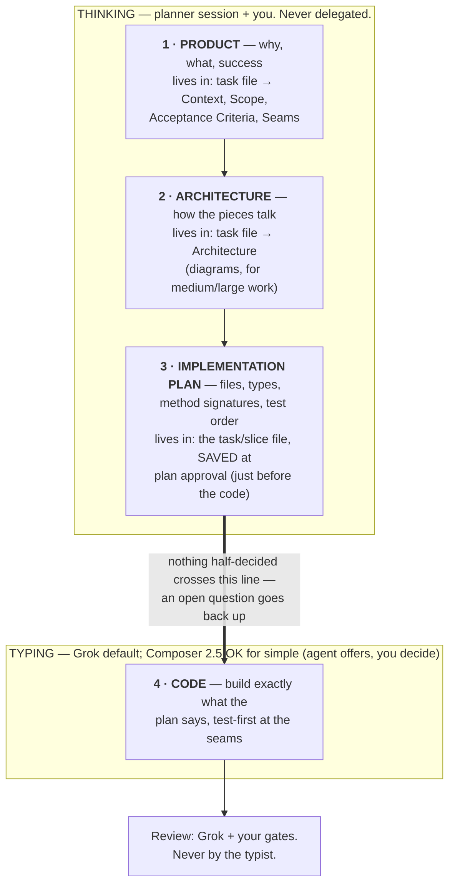

# Workflows — the practical guide

How work gets done in this repo, for agents AND humans. Symbols:

- ⚙️ = always-on rule (`.agents/rules/`, referenced from `AGENTS.md`) · 🧰 = skill (`.agents/skills/`)
- 🧑 = **you decide** — the agent stops and waits
- 🤖 = the agent works on its own

**Words used in this document** (plain definitions, details in
[methodology.md](./methodology.md)):

| Word | Means |
|---|---|
| **task** | one unit of work = one markdown file in the task workspace declared in `.agents/project.md` (default `/project-management/tasks/`) |
| **slice** | a piece of a big task, small enough to build and demo in one session; one file each |
| **seam** | the public interface we test the feature through (a service class, an HTTP endpoint, a CLI command). Agreed with you before any code, so tests survive refactors |
| **plan approval** | the moment you say "yes" to the agent's implementation plan; the approved plan is then SAVED into the task/slice file |
| **ready slice** | a slice whose "Blocked by" list is fully done — it can start now |
| **delegate** | (optional) a separate typist session that types the code from the saved plan |

---

## 0. Model policy (Cursor)

**Cost rule:** do not call expensive models (Sonnet, Opus/Fable-class, etc.)
when the context or token volume is large — that bill climbs fast. Prefer
cheap, capable defaults.

| Role | Model in Cursor |
|---|---|
| Plan, interview, architecture, design | **Grok** |
| Implement in the same session | **Grok** |
| Two-axis review (`code-review`) and review sub-agents | **Grok** |
| Typist-only sub-agent (follow a finished Design, no figuring out) | **Grok** by default; **Composer 2.5** OK for simple, mechanical diffs |

Agents must **not** recommend or spawn Sonnet (or other high-cost tiers) for
large contexts, reviews, or routine typing. Outside Cursor, keep the same
spirit: avoid premium models unless the human explicitly asks.

The THINK → TYPE *process* split below still stands (plan and save before
code). It is **not** a requirement to switch to a different model family.

---

## 1. Which situation am I in?

Every conversation starts in **Ambient** — no paperwork. The agent may
*suggest* creating a task; you decide. Then one question decides the shape:



The agent must ask the "one session?" question **out loud** and let you decide.

---

## 2. Ambient — every conversation, no paperwork

The agent silently applies the same discipline as for a task, minus the files:

| What the agent does | Comes from |
|---|---|
| Reads the reading list declared in `.agents/project.md` (§C — default: README + recent CHANGELOG) before acting | ⚙️ `task-progressing.md` |
| Proposes a plan and waits for your OK | ⚙️ `task-progressing.md` |
| Works in small verifiable steps; checks lint/tests before saying "done" | ⚙️ `task-progressing.md` / `task-completion.md` |
| If the conversation turns into real work: says so and suggests a task — never forces it | ⚙️ `task-creation.md` |

**In short: ambient = a task without the file.** Same discipline, no artifact.

---

## 3. One task — two sessions

**When:** real work that fits in one build session.

### Session 1 — CREATE (you + Grok in Cursor)

| Step | Who | What happens |
|---|---|---|
| 1. Interview | 🤖+🧑 | 🧰 `grilling`: one question at a time, with a recommended answer. Domain terms land in `CONTEXT.md`, big decisions in ADRs (🧰 `domain-modeling`) |
| 2. Agree the seams | 🧑 | the agent proposes WHERE the feature will be tested; you approve |
| 3. Write the task file | 🤖 | template + `scripts/task-id.sh`; you review the 🧑 zones |
| 4. Size check | 🧑 | agent says "fits one session" out loud; you confirm → no slices |
| 5. **Stop** | 🤖 | the agent stops here and tells you: |

> **→ Open a FRESH session and say: `work on task <file>`**

Why a fresh session: the build works from the FILE, not from the creation
chat. That keeps the file honest (if something is missing, you find out now)
and the context clean.

### Session 2 — WORK (`work on task <file>`)

One session, two halves — same **process** (think, then type); in Cursor both
halves default to **Grok** (see [§0](#0-model-policy-cursor)).

**First half — THINK (plan before any code).**

| Step | Who | What happens |
|---|---|---|
| 1. Read | 🤖 | reads the task file, README, CHANGELOG |
| 2. Plan | 🤖 | proposes an implementation plan (files, types, signatures, test order) |
| 3. Approve the plan | 🧑 | you say yes/adjust |
| 4. **Save the plan** | 🤖 | the approved plan is written INTO the task file before any code |

**Second half — TYPE.** The plan is complete; nothing is left to figure out.

| Step | Who | What happens |
|---|---|---|
| 5. Choose the typist | 🧑 | the agent OFFERS: **(a)** keep typing here (Grok), or **(b)** hand typing to a **typist sub-agent** from the saved file — Grok by default, Composer 2.5 OK for simple mechanical diffs. (b) is recommended for large diffs so the planner session stays clean to review |
| 6. Write the code | 🤖 or delegate | 🧰 `tdd` at the agreed seams, small verifiable steps |
| 7. Finish | planner 🤖 + 🧑 | lint/tests/build, browser check if UI, 🧰 `code-review` on **Grok** (two reports: follows our standards? matches the task file?) — **run by the planner session / Grok review sub-agents, never by the typist** — you arbitrate findings → archive + CHANGELOG |

---

## 4. Big feature — one parent + slices, one session per slice

**When:** it can't be built and demoed in one session, or it has real
architecture decisions.

### Session 1 — CREATE (you + Grok in Cursor)

Same as the one-task CREATE, plus:

| Step | Who | What happens |
|---|---|---|
| 1. Deep interview | 🤖+🧑 | 🧰 `grilling` + codebase exploration; glossary/ADRs as above |
| 2. Agree the seams | 🧑 | as above |
| 3. Parent task file | 🤖 | product intent + **Architecture** (how the pieces talk — diagrams); you review carefully. Slices are NOT designed here |
| 4. Cut into slices | 🤖+🧑 | 🧰 `slice-task`: each slice = buildable + demoable in one session, with its "Blocked by" list. You approve the cut (too big? too fine? right order?) |
| 5. **Stop** | 🤖 | the agent stops and tells you: |

> **→ For each ready slice, open a FRESH session and say:
> `work on slice <file>`**

### The slice loop — one fresh WORK session per slice

A slice is **ready** when everything in its "Blocked by" list is done.
Several ready slices = several parallel sessions if you want. Inside each
session, the order is always **think first, type second**:



Same seven steps as the one-task WORK session, applied per slice. The slice
file must be enough on its own — if a session can't work from it, the file
(not the session) gets fixed.

---

## 5. Who thinks, who types

Four phases, in order. Each lives in ONE place and has ONE owner. Only the
LAST one may go to a separate typist session — and only if you ask. Models:
[§0](#0-model-policy-cursor).



If you delegate the typing, the delegate gets **files only, never the chat**:
the slice file + what it links to (parent task, `CONTEXT.md`, cited examples)
+ the repo's standard context. If it can't build from that, the plan wasn't
complete — fix the file.

---

## 6. Where things live — one file vs parent + slices

| Content | One task | Big feature |
|---|---|---|
| Why / what / success criteria / seams | the task file | the **parent** file |
| Architecture (diagrams) | the task file (if medium) | the **parent** file |
| Implementation plan | the task file — saved at plan approval | **each slice file** — saved at that slice's plan approval. Parent keeps only decisions that span slices |
| Slice list + "Blocked by" | — | the parent file |
| Work notes, snippets | the task file (🤖 zone) | each slice file (🤖 zone) |
| Status | the task file | per slice; parent stays open until the last slice |
| Archive | file → `archive/` when done | parent + folder → `archive/` after the last slice |

On disk:

```
One task:                           Big feature:
tasks/                              tasks/
└── 20260810-1200-fix-thing.md      ├── 20260803-1850-admin-mvp.md   ← parent
                                    └── 20260803-1850-admin-mvp/
                                        ├── 01-acquisition-domain.md ← slice
                                        ├── 02-tidal-client.md
                                        └── …
```

---

## 7. Side lanes

Not everything starts as a feature idea:

| Situation | Use | Then |
|---|---|---|
| Something's broken (hard bug, flake, regression) | 🧰 `diagnosing-bugs` — first build a repeatable failing check, THEN theorize; regression test before the fix | fix lands as normal work |
| A design question you can't settle by talking ("does this state model work?") | 🧰 `prototype` — throwaway code, one command to run; keep the answer, delete the code | back into the interview |
| Reading legwork (docs, API facts) | 🧰 `research` — background agent, cited markdown file | feeds the interview |
| So big and foggy you can't even slice it | 🧰 `wayfinder` — map the open DECISIONS first, resolve them one by one | then create the parent + slices |
| Spare moment, make the codebase nicer to work in | 🧰 `improve-codebase-architecture` | generates an idea → normal flow |
| Raw issues from an external tracker | 🧰 `triage` — **dormant** until Linear/GitHub is wired | → normal flow |

---

## 8. Session hygiene

- **Create in one sitting**: interview → task file → slice cut, without
  clearing the conversation — those steps feed each other.
- **Build fresh**: every build session starts clean, from the file. That's
  why saving the plan into the file matters — the file is the only bridge
  between sessions.
- **Long session going dull?** Past ~120k tokens an agent reasons worse.
  Don't push through — 🧰 `handoff` writes a summary file; open a fresh
  session pointing at it.

## 9. Rules of thumb

- Unsure whether to create a task → stay ambient; the agent will suggest one
  when it's warranted, and you decide.
- Unsure one-task vs big-feature → the "one session?" question decides, out
  loud, and you arbitrate.
- Picking a model in Cursor → **Grok**, unless the human asked otherwise.
  Composer 2.5 only for simple typist work. Never default to Sonnet on a
  fat context (see [§0](#0-model-policy-cursor)).
- Most work should stay small: roughly 40% quick ambient fixes, most of the
  rest one-task; the full parent+slices machinery is for genuinely large
  features. If everything becomes a big feature, review gets diluted and the
  method has failed.
